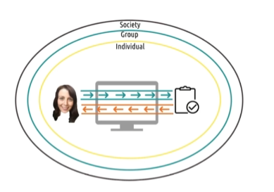

## 2.10 Conclusion to Principles

### 2.10.1 - Introduction to Conclusion to Principles

[MUSIC] In this unit we've talked about the various different design principles that have been uncovered after years of research and work in HCI.

And while they are presented in many ways as individual sets of guidelines and principles, there is a lot of overlap among them.

So in this recap of the unit, we'll try to tie all these seemingly different threads together. We'll also ask you to reflect on how you might apply some of these concepts as a whole to certain design problems.

### 2.10.2 - Zooming Out: Human as Processor

- One way of knitting together the different ideas of HCI is to start very close and zoom out.
- At the narrowest level, we might view HCI as the interaction between a person and an interface.
- This is the processor model of the role to human knit system.
- This too looks almost like an interaction between two computers,
  - one just happens to be a human.
- But humans' actions are approached almost computationally.
- If you're going to take this model,
  - we need to understand a lot about what the human can
  - sense,
  - remember, and
  - physically do.
- The model approaches HCI in this manner as well.
- It distills the human's role into
  - goals,
  - operators,
  - methods and
  - selection of rules,
  - all of which can be externalized.
- But this is a pretty narrow view of HCI.

### 2.10.3 - Zooming Out: Human as Predictor

- For the most part, we're interested in something more task-focused.
- In fact, this is where we'll likely spend the majority of our time.
- This is the user interacting through some interface to accomplish some task.
  - That's what we mean by the predictor model of the user.
- The user is actively involved in
  - looking at the task,
  - making predictions about what to do, and
  - making predictions about what will happen.
- This is where we looked at the gulf of execution and the gulf of evaluation.
  - How hard is is for the user to interact with a task?
  - And how hard is it for them to get feedback on their interaction?
- Here we also look at how the interface can ideally disappear from this interaction,
  - making the user feel like they're working directly with the task,
  - not interacting with an interface.
- Now, many of our design principles are constructed specifically to help with this.
  - To help users more quickly make sense of the interface, and
  - understand the underlying task.
- But in order to design this interaction effectively,
  - we have to understand the way the user thinks about the task they're performing.
  - We have to understand their mental models and in turn,
  - we have to help make sure their mental models match the actual task.
- Here we have to get into questions like
  - understanding the user's errors and
  - understanding the mapping between representations and the understanding tasks.
- We also have to address questions like expert blind spot and learned helplessness.
- Now, fortunately, we have a tool to help us with this.
  - Cognitive task analysis and its related hierarchical task analysis.
    - So much of what we deal with in HCI occurs within this process of a human completing a task through some interface.

### 2.10.4 - Zooming Out: Human as Participant

- However, that's not all we're interested in.
- We're also interested in how this interaction occurs beyond just the individual and the interface and the task.
- That's what was meant by the participant model of the user.
  - The user is not merely interacting with an interface or interacting with a task through an interface.
  - They're interacting with
    - other interfaces,
    - other individuals and
    - society as a whole.
  - They are active participants in the world around them.
- For example, sometimes we're interested not only in the tasks of the users performing,
  - but also in their motivations and reasons for performing it.
- That's what activity theory advocates.
- Treating the unit of analysis not as a task,
  - but as an activity including some elements of the context surrounding the task.
- Other times we're interested in how artifacts and minds combine to help accomplish the task.
  - That's what distributing cognition advocates.
- Or other times we are interested in deeply understanding the situated context in which a person is acting,
  - that's where situated action comes in.
- And other times, we're interested in how this all integrates with existing social norms and social relationships.
  - That's what social cognition tries to examine,
- other times
  - we're interested in dynamics even broader than this.
  - Sometimes, we're interested in how the interfaces we design can create positive social change. Or
  - sometimes we're interested in how the interfaces we design might risk perpetuating existing negative relationships in society.
- That's exactly the goal of some of our design guidelines as well.
- To use interfaces to create a more equal society for all people.
- So this diagram describes from a very low level to a very high level,
  - what we're interested in throughout this portion of HCI.

### 2.10.5 - Reflections: HCI Principles Question

- When we started that conversations I commented that
  - when you do HCI right, users won't actually know you've done anything at all.
- Good HCI disappears between the user and the tasks that they're completing.
- As a result, people can underestimate how complex good HCI can be to leverage.
- In this unit, one of my goals has been to help pull back the curtain on all the theories that go on behind the scenes of the designs of some of the interfaces that you use everyday.
- So as we close this unit, take a second to reflect on the interfaces you use that have disappeared between you and the task.
  - Focus especially on interfaces that were never visible in the first place,
  - not interfaces that became invisible by learning.
- Which of the principles that we've discussed do you now see at play in the design of some of those interfaces?

### 2.10.5 - Reflections: HCI Principles Solution

- For me, I'm actually using an example of one of these interfaces right now.
  - I have a teleprompter in front of me.
  - I didn't always use a teleprompter,
    - but as soon as I tried one, I was hooked.
  - And part of that is because of how well designed the interface is.
  - The very first time I used it,
    - it made things immediately easier,
    - instead of introducing a new learning curve.
  - First, it uses very simple interactions,
    - quick presses that accomplish anything I could need during the actual recording process.
  - Second, it builds on a good mental model of the task that I'm performing.
    - It understands, that while recording, the only things I need to do regularly are pause, play, scroll back, and scroll forward.
    - There are a lot of other options that it has but it keeps those out of the way during the actual recording process, because they're not necessary at the time.
- Personally though, I think the teleprompter is great to analyze from the prospective of distributed cognition.
  - I struggle when recording with talking too fast.
  - Without the teleprompter, I have to remind myself to slow down,
    - while also remembering what to say.
  - That's a lot to keep in memory at the same time.
  - The teleprompter lowers the cognitive load involved in remembering what to say,
    - but it also controls my speed because I can't read what hasn't yet appeared.
  - So the teleprompter takes care of two cognitive processes.
    - Remembering what I have to say, and
    - monitoring the speed at which I am presenting.
- So the system comprised of the teleprompter and me is better at recording than I am alone.

### 2.10.6 - Design Challenge: Designing Audiobooks for Exercisers Question

- Let's go back to our original design challenge for Morgan from the very beginning of this unit.
- We talked about how Morgan wants to be able to listen to audio books on the go
  - which includes things like
    - leaving bookmarks and
    - taking notes.
- Using everything we've talked about so far, revisit this problem.
- Start by thinking narrowly about the physical interactions between Morgan and the interface and
  - then zoom out to her interactions with the task as a whole,
  - then zoom out even further to how the interaction between Morgan and the interface or relates to other things going on in the world around here.
  - And last, think about how interfaces like this have the potential to effect society itself.

### 2.10.6 - Design Challenge: Designing Audiobooks for Exercisers Solution

- There are a lot of designs that you could propose,
- but the question here isn't what you design,
- the question is, how will you develop it?
- How will you evaluate it?
- How do you know which ideas are good and which are bad?
- Now we've given some heuristics and principles for doing this,
  - but that doesn't automatically get you to a good interface.
- That just kind of establishes a baseline.
- That's just what the principles portion of this course covers.
- To fully develop interfaces using these principles, we need the methods of HCI as well.

### 2.10.7 - Explore HCI: HCI Principles

- Throughout this unit, I repeatedly ask you to revisit the area of HCI you chose to keep in mind throughout our conversations.
- Now, take a second, and try to pull all those things together.
- You've thought about
  - how your chosen area applies to each of the models of the humans role.
  - How it applies to various different design guidelines, and
  - how it interacts with society and culture as a whole.
- How does moving through those different levels changed the kinds of designs you have in mind.
  - Are you building up from low-level interactions to high-level effects?
  - Are you starting at the top with the desired outcome and working your way down to the individual operations?
- There are no right or wrong answers here.
- The important thing is reflecting on your own reasoning process.

### 2.10.8 - 5 Tips: On-Screen UI Design

- I mentioned in one of our first conversations that this course is distinct from user interface design course.
- We're interested in general principles and general methods for designing interactions between humans and various different kinds of computational devices.
- Designing for traditional screens has its own set of specific principles.
- However, it's quite likely that you'll be designing for this kind of traditional device.
- So, here are five quick tips for designing effective onscreen user interfaces.

1. Number 1, use a grid.
   - Grids are powerful ways of
     - guiding users site around your interface,
     - highlighting important content,
     - grouping together content,
     - and so on.
   - There's a reason why newspapers and magazines have used grid-based layouts for decades.
1. Number 2, use whitespace.
   - Users are very good at consuming small chunks of information at a time.
     - Notice how news articles often use very short paragraphs and
     - how, why science have lots of whitespace around the text.
   - Whitespace works with grids to provide context and guide the user's visual perception of the interface.
1. Number 3, know your Gestalt principles.
   - Gestalt principles in UI design refer to how users perceive groups of objects.
   - It uses group objects together when they're
     - especially close together, when they're
     - visually similar, when they're
     - moving together, so use that.
1. Number 4, reduce clutter.
   - The eye has difficulty processing cluttered information,
   - so reduce clutter wherever possible.
   - Grids, whitespace, and Gestalt principles can help with this
     - because they invisibly communicate content that might otherwise need to be communicated visually.
   - Instead of drawing a box to group controls together,
     - you can surround them with whitespace.
   - Instead of using headers and texts to label different portions of some content,
     - you can separate them with a grid and so on.
1. Number 5, design in grayscale.
   - Color can be a powerful tool,
     - but it also runs array of universal design.
   - There are enough color blind individuals in the world that relying on color too much is really problematic.
   - Color can emphasize the content and structure of your interface,
     - but it shouldn't be necessary to understand it.
   - Take a stoplight, for example.
     - Red means stop and
     - green means go,
     - which is a problem if you're deuteranopic or red-green colorblind,
   - but the red light is always at the top and the green light is always at the bottom.
     - So, even if you are deuteranopic, you can still understand what the light is saying.
   - Color emphasizes the content, but the content doesn't rely on the color.
   - If you're going to be doing a lot of screen-based UI design,
     - I do highly recommend taking a class in the topic.
     - It will cover these principles and a lot more depth,
       - give stronger rules for designing good grades and using whitespace, and
       - cover one of my favorite topics, typography.
   - Amanda can testify that more thought went into selecting the fonts to use in this course than nearly any other element of its design.
   - If you're curious, it's Ubuntu Condensed for the diagrams and Oswald for the bloops. Well, except that one.
     - 

### 2.10.9 - Only Half of the Picture

- There's one final thing you must understand about the guidelines and heuristics and principles we've talked about.
- They're only half the picture.
  - They're necessary for good design, but they aren't sufficient.
- You can't just grab these guidelines off the shelf,
  - throw them at a new task, and
  - expect to have a perfect interface the first time.
- These principles give you a solid foundation.
- But every
  - domain, every
  - task, every
  - audience
  - has its own unique requirements and criteria.
- To design usable interfaces, you have to understand your specific user.
- Remember, that isn't you.
  - What that means is that you have to go out and find what your users need.
  - You have to get inside their head and understand the task.
  - You have to prepare multiple different ideas for them to try out.
  - You have to evaluate those ideas with real users.
  - You have to take that experience and use it to improve your design, and start the process all over again.
- These guidelines and principles are useful in making that process as efficient as possible,
  - but they aren't sufficient on their own. These principles are only half the picture.
- The other half are the methods.
