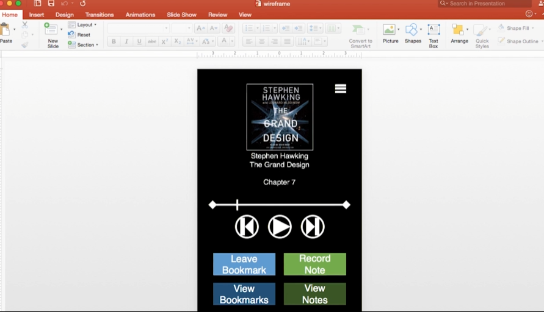
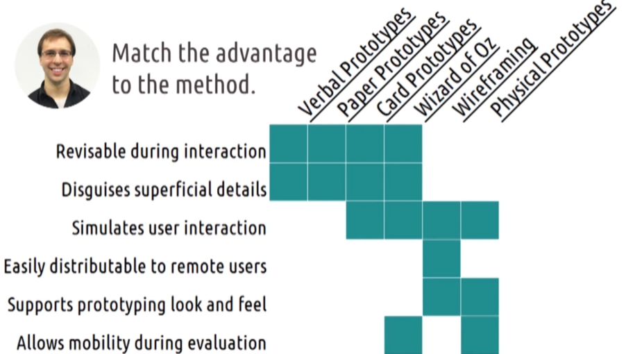

## 3.5 Prototyping

- [3.5.1 - Introduction to Prototyping](#351---introduction-to-prototyping)
- [3.5.2 - Basics of Prototyping](#352---basics-of-prototyping)
- [3.5.3 - Tradeoffs in Prototyping](#353---tradeoffs-in-prototyping)
- [3.5.4 - 5 Tips: Prototyping](#354---5-tips-prototyping)
- [3.5.5 - Verbal Prototypes](#355---verbal-prototypes)
- [3.5.6 - Paper Prototyping](#356---paper-prototyping)
- [3.5.7 - Wizard of Oz](#357---wizard-of-oz)
- [3.5.8 - Wireframing](#358---wireframing)
- [3.5.9 - Physical Prototypes](#359---physical-prototypes)
- [3.5.10 - Exercise: Prototyping Pros and Cons Question](#3510---exercise-prototyping-pros-and-cons-question)
- [3.5.10 - Exercise: Prototyping Pros and Cons Solution](#3510---exercise-prototyping-pros-and-cons-solution)
- [3.5.11 - Design Life Cycle Revisited](#3511---design-life-cycle-revisited)
- [3.5.12 - Multi-Level Prototyping](#3512---multi-level-prototyping)
- [3.5.13 - Exploring HCI: Prototyping](#3513---exploring-hci-prototyping)
- [3.5.14 - Conclusion to Prototyping](#3514---conclusion-to-prototyping)

### 3.5.1 - Introduction to Prototyping

- [MUSIC]
- So we've talked to our users.
- We've gathered some understanding of what they need.
- We've created some ideas for how we might address their need and we've mentally simulated those different alternatives.
- Now it's time to start actually making things we can put in front of users.
- [SOUND]
- This is the prototyping stage.
- Like brainstorming design alternatives, this involves looking at the different ideas available to us and developing them a bit.
- But the major distinction is that in prototyping, we want to actually build things we can put in front of users.
- But that doesn't mean building the entire interface before we ever even have a user look at it.
- We want to get user feedback as quickly and rapidly as possible.
- And build up more sophisticated prototypes over time as we go through the design life cycle.
- So we'll start with low fidelity prototypes, things that can be assembled and revised very quickly for rapid feedback from users.
- Then we'll work our way towards higher fidelity prototypes, like wire frames or working versions of our interface.

### 3.5.2 - Basics of Prototyping

- To discuss prototyping there are a variety of different terms and concepts we need to understand.
  - For the most part, these will apply to where in the prototyping timeline those concepts are used.
- In the early prototyping,
  - we're doing a very rapid revision on preliminary ideas.
  - This happens on our first few iterations through the design lifecycle.
- In late prototyping,
  - we're putting the finishing touches on the final design, or revising a design that's already live.
  - This happens when we've already been through several iterations of our design lifecycle.
- At the various phases, we'll generally use different types of prototypes in evaluations.
- Now, note that everything I'm about to say is pretty general, there will be lots of exceptions.
  - The first concept is representation,
    - what is the prototype?
    - Early on, we might be fine with just some textural descriptions or some simple visuals that we've written up on a piece of paper.
    - Later on though, we'll want to make things more visual and maybe even more interactive.
    - We only want to put the work into developing the more complex type of prototypes once we vetted the ideas with prototypes that are easier to build.
    - So in a lot of ways, this is a spectrum of how easy prototypes are to build over time.
  - A verbal prototype is literally just a description, and I can change my description on the fly.
  - A paper prototype is drawn on paper, and similarly, I could ball up the paper, throw it away, and draw a new version pretty quickly.
  - But things like actual functional prototypes that really work, those take a good bit of time.
    - And so we only want to do those once we've already vetted that the ideas that we're going to build actually have some value.
    - You don't want to sink lots of months and lots of engineering resources into building something that actually works. Only to find out there's some feedback you could have gotten just based on a drawing on a piece of paper that would have told you that your idea wasn't a very good one.
  - This brings us to our second concept, which is fidelity.
    - Fidelity refers to the completeness or the maturity of the prototype.
      - A low-fidelity prototype would be something like paper or simple drawings, very easy to change.
      - A high-fidelity prototype would be something like a wireframe or an actual functional working interface, something that was harder to put together.
    - We want to move from easily changeable low-fidelity prototypes to explore our ideas, to higher-fidelity prototypes to really test them out.
    - Note that fidelity and representation are pretty closely related, low-fidelity is really about a prototype that's pretty far from being complete. And the same thing is true for some of our early methods of prototyping. They describe different ideas, but they very heavily correlate what kinds of representations you're going to use for different levels of fidelity.
    - Now these different kinds of prototypes also lend themselves to different kinds of evaluation structures.
      - Low fidelity prototypes can fine for evaluating the relative function of an interface, whether or not it can do what's it's designed to do.
        - If a user looks at the interface can they figure out what they're supposed to press?
          - You can prototype that was just a drawing on a piece of paper, as opposed to a real functional prototype.
        - Things like wireframes can be useful in evaluating the relative readability of the interface as well.
      - However, to evaluate actual performance,
        - like how long certain tasks take,
        - or what design leads to more purchases.
        - We generally need a higher fidelity prototype, through more iterations of the design lifecycle.
      - So early on, we're really just evaluating whether or not our prototype even has the potential to do what we want it to do.
        - Can a user physically use it?
        - Can they identify what button to press and when?
      - For that we need additional detail like font size and real screen layout.
      - We need a real prototype that looks the way the final interface will look, even if it doesn't work quite yet.
      - And then, to evaluate performance we really need a prototype that's working, or close to working, to evaluate certain tasks.
  - And then the final concept we need to understand, is
    - the scope of the interface.
      - Is it a horizontal prototype or a vertical prototype?
        - **Horizontal prototypes cover the design as a whole, but in a more shallow way.**
        - **Vertical prototypes take a small portion of the interaction and prototype it in great detail.**
      - So for example, if we were designing Facebook, we might have a vertical prototype specifically for the status-posting screen and a horizontal prototype for the site in general.
      - Now, in my experience,
        - **we usually start with horizontal prototypes earlier on, and move toward the deeper vertical prototype later.**
        - But in reality, you'll likely move back and forth among these more frequently throughout you iterations through the design lifecycle.
  - So, these are four the main concepts behind prototyping.
    - There are other questions we might ask ourselves as well.
      - Like whether we're prototyping iterative or revolutionary changes, and the extent to which the prototype needs to be executable.
      - But in many ways, those fall under these previous concepts.

### 3.5.3 - Tradeoffs in Prototyping

- Prototyping is largely about the trade-offs we have to make.
  - Low-fidelity prototypes like drawings are easy to create and modify,
    - but they aren't as effective for detailed comprehensive evaluations.
  - High-fidelity prototypes like actual working interfaces can be used for detailed feedback and evaluation,
    - but they're difficult to actually put together.
- So, our goal is to maximize these trade-offs.
- We want to start with the easier low-fidelity prototypes to get initial ideas to evaluate big designs and big plans and to make sure we're on the right track.
- Then as we go along, we can move towards the higher-fidelity prototypes to take more time to assemble because we have initial evidence that our designs are actually sound.
- It's really important here also to note that our prototypes are prototypes.
  - They aren't complete interfaces.
  - We've discussed in the past that designers often have a tendency to jump straight to designing rather than getting to know their users.
  - That's a big risk here as well because we're designing, but we're designing specifically to get more feedback.
- So, don't become a runaway train of designing. Designed deliberately and get feedback often.

### 3.5.4 - 5 Tips: Prototyping

Here are five quick tips for effective prototyping.

1. Number 1, keep prototypes easy to change.
   - Your goal here is to enable rapid revision and improvement.
   - It's easy to make quick changes to something on paper, but it's harder to make it a code or physical prototypes.
1. Number 2, make it clear that it's a prototype.
   - If you make a prototype look too good, users may focus on superficial elements like colors or font. By letting your prototype look like a prototype, you can help them focus on what you're ready to test.
1. Number 3, be creative.
   - Your goal is to get feedback. Do whatever it takes to get feedback. Don't let the type of prototype you're designing constrain the kind of feedback you can get. If you find your current prototypes don't give you the right kind of feedback, find ones that do.
1. Number 4, evaluate risks.
   - One of the biggest goals of prototyping is to minimize the time spent pursuing bad designs by getting feedback on them early. How much would you lose if you found that users hate the parts of your design that they haven't seen yet? Whenever that answer gets to be longer than a couple hours, try to get feedback to make sure you're not wasting time.
1. Number 5, prototype for feedback.
   - The goal of a prototype is to get feedback. You could spend a lot of time focusing on details like font selection and color choice, I know I do, but that's probably not the feedback you need when you're exploring your big alternatives. Prototype for the kind of feedback you want to get.

### 3.5.5 - Verbal Prototypes

- At the very simplest, we have verbal prototypes.
  - That means we're literally just describing the design we have in mind to our user.
- That's probably the lowest fidelity prototype possible.
  - It's literally just telling the user the same thing we tell our co-designers.
  - So, it's extremely easy to do, although it can be hard to do effectively.
- **Social desirability bias**is big here because it's difficult to describe our idea in a way that allows the participant to feel comfortable disagreeing with us.
  - So, we need to make sure to ask for specific and critical feedback.
- At the same time though, how do we really know that the user understands the design we're describing?
  - We're working toward becoming experts in the areas which we're designing, and we don't want to fall victim to extra blind spot by assuming our explanation makes sense to a novice.
  - For that reason, analogies can be powerful tools for explaining prototypes.
    - Describe your interface in terms of other tools a user might already know about.
    - So, for example, imagine I was pitching the idea of Instacart, a grocery delivery company.
      - I might have described it like it's like Uber for groceries.
        - Uber is a service like taxis, and
        - Instacart is like a taxi for groceries.
    - That way of describing it in terms of an analogy to another interface can be a powerful way of helping your participant understand your idea more quickly.

### 3.5.6 - Paper Prototyping

- One step above just describing our ideas to our user in a verbal prototype would be actually drawing them out.
- This is what we call a "Paper prototype."
  - We could do this for anything,
    - from designing an on-screen interface to
    - designing the placement of controls in a vehicle.
  - Let's go back to our example of designing away for exercisers to consume and take notes on audio books.
    - Let's imagine one of my design alternatives was for a very easy to use app, so that the hassle of pulling out your phone and pressing buttons isn't actually too distracting.
      - I might start this process simply by drawing a prototype of my interface on paper.
      - Now I have a paper prototype.
      - Now, I can talk to my user, and
        - I could ask her thoughts about it.
        - We'll talk about the kinds of thoughts I'll ask about when we talk about evaluation, but generally, I can say, "Hey, Morgan, what do you think about this design?"
        - Looks pretty good. Straight forward. There's play. There's fast-forward. I would like a way to see where I am in the book, though. That makes sense.
      - Notice that she didn't comment on color, or font or anything like that, not because I said, "Hey, I'm ignoring font right now," but because it's pretty obvious I'm not really caring about font right now.
      - The nature of the paper prototype is it tells the user what kind of feedback we're looking for.
      - We're looking for pretty basic layout information. Now, because this is on paper,
        - I can actually immediately revise my prototype and incorporate the things that she suggested.
      - Now, I have a revision based on her feedback, and I can ask,
        - "Hey, how's that?"
      - Looks great, David. Thank you.
- Now, paper prototyping isn't only useful for testing out just single interface designs.
- You can also do some interaction with it.
  - Watch. So, here I have four screens prototyped.
  - So, when I give this to Morgan, and I can say things like,
    - imagine you're viewing the screen and you want to take a note to attach to your current place in the book, what would you probably do?
      - Probably press the view their notes button.
      - That makes sense.
    - After you press that, what you're going to see is this screen for note-taking. So, what would you do then?
      - Well, if I want to take a note, then I would press the record button there.
      - Yes. Exactly. Then it would start recording you. It would transcribe what you say, and then at the end you'd press stop to continue.
  - So interestingly, just doing this, I've already noticed that there's really no reason to make her jump to a separate note-taking screen, which you want to take a note while listening.
  - It should actually just be a note-taking button here on the main screen.
  - So, just like this, I could walk through some interaction with the app on paper and and get some ideas like that about how I can improve it.
- This is also called card-based prototyping.
  - The idea is each screen is on a different card, and I can quickly set those cards and announce so we can simulate what it would be like to use the real application.
  - So, that way I can prototype a decent amount of the interfaces interaction with pretty low prototyping effort meat.

### 3.5.7 - Wizard of Oz

- Paper prototyping is great when we're designing flat interfaces for screens, but what if you're designing a voice interface or a gesture interface? How do you prototype that?
  - One way is called the Wizard of Oz prototyping.
- Wizard of Oz prototyping is named as a reference to the famous scene from the classic movie by the same name.
  - Pay no attention to that man behind the curtain.
  - The idea here is that we, behind the curtain, do the things that the interface would do once it's actually implemented.
    - That way, we can test out the interactions that we plan to design and see how well they'll work.
  - So, I have Morgan and we're going to do a Wizard of Oz prototype for an interface to allow exercisers to consume and take notes on audio books.
    - So, I'll start by briefly telling her how the interface would work.
      - So, this interface is run by voice commands,
      - I'll simulate it on my phone, and
      - you'll say play to play the book, pause to pause the book.
      - You'll say note to enter a note-taking viewer, it will transcribe what you say, and bookmark to just drop a bookmark wherever you are but without pausing.
    - So, whenever you're ready. Let's do it. All wealth consists of desirable things, Pause. That is things with, Play, Which satisfy human wants directly or indirectly, Bookmark, But not all desirable things are recognized as wealth. The affection, Note. Of friends for in,
    - This book is so good. Oh, I just realized actually, I guess I need a way for you to stop the note when you're done.
      - So, say close note when you're done taking note. Close note. All right, you can stop.
  - Now, based on this prototype, I can also ask for some feedback.
    - So, Morgan, do you think it should automatically start playing again when you stop that bookmark or should it, what should it do?
      - Well, okay. So, I think I'd actually like to start playing from five seconds back because I imagine saying note is going to step over some of the content.
      - Yeah, that makes sense and we can go through this and quickly test out different ideas for how the interaction might work.
- In practice, Wizard of Oz Prototypes can actually get very complex. You can have entire programs that work by having a person supply the requested input at the right time.
  - But as a concept, a Wizard of Oz Prototype is a prototype where the user can now interact authentically with the system while a human supplies functionality that hasn't yet been implemented.

### 3.5.8 - Wireframing

- Paper prototyping involve drawing things simply on paper, and it can be really good for experimenting with overall layouts, especially because it tends to be a lot easier to revise and tweak those pretty naturally. After some feedback though, you'll likely want to start formalizing your designs a little bit more.
  - One way of doing this would be called wireframing.
- In wireframing,
  - we use some more detailed tools to mark up what an interface might look like.
- For example, my paper prototype from earlier might become a wireframe like this.
  - 
  - This lets us experiment with some additional details like font size, colors, and the challenges of screen real estate.
  - Now, there are lots of tools out there for wireframing that come equipped with built-in common widgets and layouts.
  - But you can also do some rudimentary wireframing in something as simple as PowerPoint. Google Drawings can be used the same way as well. So, you don't need to get super fancy. Although if you do a lot of wireframing, you're probably want to find a more streamlined tool.
  - Some of the more popular paid products include Balsamiq and Axure. These are both targeted more at professionals working in user interface or user experience design, especially on teams and collaborating with a lot of people.
  - If you're familiar with the suites of tools from either Microsoft or Adobe, then Visio or InDesign might also be great options for you to use, because you're already somewhat familiar with those interfaces. But you don't actually have to buy a tool to do good wireframing.
  - There exists some free to use tools out there as well, like the pencil project and frame box. Those are great to use, especially if you're just getting started. Of course., these are just the popular ones that I know about right now.
  - There are almost certainly more out there that I'm not familiar with, and more will surely come available.
  - So, check with your classmates or colleagues to see what they would recommend.
  - I'm personally really excited to see what kind of prototyping options emerge for areas like virtual reality and augmented reality, where you can't really prototype on a 2D canvas like this.

### 3.5.9 - Physical Prototypes

- Wire-framing is great for prototyping onscreen interfaces but, again, what if you're working on something more physical or 3-dimensional?
  - In that case, you might want to construct a physical prototype, but let's be clear, it doesn't have to actually work.
  - That's where a lot of designers get tripped up.
  - They think to get good feedback on a design they have to have a working version, but you don't.
- There are lots of elements you can test without actually implementing anything.
- So, let's go back to our example of designing a way for exercisers to take notes on audio books.
  - One of my alternatives might be a Bluetooth device that synchronizes with the phone, with buttons for different interactions.
    - The individual will hold this while exercising and interact by pressing different buttons for play or pause or take a note.
    - I've prototyped this just by taking my car's key fob.
    - We could just say that we pretend this button does this and that button does this.
    - It's probably not the exact shape I want but it's pretty close.
    - It's probably about the same size and I can test the general idea of pressing buttons while exercising with this.
    - I can actually do a lot of testing with this I can tell Morgan how it works, and watch carefully to see if the button she presses are the right ones to evaluate the intuitiveness of the interface.
    - Or I could just ask her to go running while holding it and give me feedback on whether or not holding something physical like this in her hand throws off her routine at all.
- I can do a lot of prototyping without a working version

### 3.5.10 - Exercise: Prototyping Pros and Cons Question

- In this lesson we've covered various different methods for prototyping.
- Each method has its advantages and disadvantages.
- So let's start to wrap up the lesson by exploring this with another exercise.
- Here are the methods that we've covered and here are some of the potential advantages.
- For each row, mark the column to which that advantage applies. Note that as always, these are somewhat relative, so your answer might differ from ours.

### 3.5.10 - Exercise: Prototyping Pros and Cons Solution

- 
- So here are my answers.
- First when we're talking about things that are revisable during interaction, we're talking about things that I as the experimenter can get feedback from my user and immediately change my prototype.
  - So if they say that that button label doesn't really makes sense, I can cross out that button label and immediately change it.
  - That makes sense for prototypes that are very low fidelity.
    - Verbal prototypes, I can immediately say okay, then let's make it the way you just described.
    - Paper prototypes or card prototypes, I could quickly erase or cross out something on my prototype and change it.
    - Wizard of Oz is similar. Since I'm running what's going on behind the scenes, I can just change the way I'm running it.
  - Those four prototypes, because they're more low fidelity, also disguises superficial details.
    - No one is going to look at a prototype that I drew by hand and say they don't like the font.
    - No one is going to to listen to me run a Wizard of Oz prototype for a voice interface and say, I don't like the voice that you're using.
  - These help us focus on the overall patterns of interaction and disguise some of the superficial elements that users would often have a tendency to get distracted by.
  - However, as we prototype, we need to move from designing interfaces to designing interactions. Verbal prototypes and paper prototypes don't really cover interactions, they cover showing something and asking the user what they think, but they don't really go further than that. Card prototypes, Wizard of Oz prototypes, to a certain extent wireframing and to a certain extent physical prototypes all let us actually simulate the user interaction.
  - With a card prototype, we're actually saying if you did that, then you would see this, so they can walk through the pattern of interaction.
  - Wizard of Oz, we can simply call out or describe or simulate, this is what would happen if you do what you just described.
- Now, wifeframing you could do more like a paper prototype, where it's just a simple wire frame, but more generally, we use wire frames when we're ready to actually show different interfaces and the movement between them.
- Similarly with physical prototypes, the main reason why we would do a physical prototype is to hand a user, and say, pretend you're jogging, or pretend you're working in your office.
  - How would this interact with what you're actually doing?
  - We're simulating the way they would physically use it.
- Now among all of these, the wires frames are really the ones that are most easily distributable to remote users.
- You can make an argument that we can send scans for a paper prototypes but generally, a paper prototype isn't just about what's on paper.
- It's also about the conversations and descriptions that we're having around it and asking users what they think about certain elements.
  - Whereas a wire frame is more about a general impression that users get.
  - You can make the argument that paper prototypes can be sent easily, as well. But for me, I would only share wire frames with remote users.
  - Now prototyping look and feel is really just the inverse of disguise and superficial details. Look and feel is really about those superficial elements that have a significant user impact, but are more easily modifiable within an overall pattern of functional interaction.
  - So just as the earlier low fidelity prototypes support disguising details, the later ones support prototyping look and feel.
  - As computers become more ubiquitous, and users are moving around while interacting with interfaces more and more, allowing mobility is really valuable.
  - Wizard of Oz, since we're just calling things out to the user, let them move around, and same with physical prototypes.
    - We can actually hand them to a user and have them physically interact, the way they would with the actual interface

### 3.5.11 - Design Life Cycle Revisited

At this point, there's a risk of a major misconception that we should cut off right now. We started with need finding, then develop some design alternatives, and now we're prototyping. We've talked about how prototyping follows a timeline to low fidelity to high fidelity prototypes, from early to late prototyping. We might think that we move on to evaluation when we're done prototyping. That's not the way the design life cycle works though. We go through this cycle several times for a single design and a single prototype corresponds to a single iteration through the cycle. So we did some initial needfinding, we brainstormed some alternatives, and we prototyped those alternatives on paper. We don't jump straight from doing them on paper to doing them via wire framing or doing a functional prototype. We take those prototypes and we use them for evaluation. We evaluate those paper prototypes with real people. The results of that evaluation tell us if we need to go back and understand the task even better. Those results help us reflect on our alternatives as a whole, maybe come up with some new ones. Then, equipped with the results of that evaluation, that additional needfinding, and that additional brainstorming, we return to the prototyping phase. If our prototype seemed to be pretty successful and pretty sound, then maybe it's time to raise the fidelity of it. Maybe we take it from a paper prototype and actually do some wire frames, or do a car prototype around the actual interaction. If it wasn't very successful though, when we reach back here, we're going to do a different paper prototype, or a different low fidelity prototype, and then go to evaluation again. Each time we develop a new prototype we go through the same cycle again. Now that might sound extremely slow and deliberate but we also go through this on a very different time scales too. So for example, after we've gone through needfinding and designing alternative brainstorming, we can develop a paper prototype. We give it to a user and get their evaluation. They say that they don't like it. We ask them why, we ask them to describe what about their task isn't supported by that interface. That's in some ways another needfinding stage. Then we brainstorm real quick how we could resolve that. Maybe we just do that while we're sitting with that user and think it didn't support this element of what they described, but I could add that pretty quickly just by making this button or this function more visible. Now we very quickly have a new prototyping just by sketching out that addition to that paper prototype and now we can do it again. This cycle could take one minute. We could take one prototype, put it in front of a user, get their evaluation, figure out what they liked and didn't like, brainstorm a way to fix that, and then immediately revise it and try it again. We can go through this very, very quickly. We could also go through this very slowly, we could have prototypes that take months to develop. And generally that's why we only want to do that after we've gone through the cycle a few times. Because if we're going to take months to develop a prototype, we want to make sure we're probably going to get some pretty good evaluations on it. And we can make sure of that by prototyping the elements in lower fidelity first.

### 3.5.12 - Multi-Level Prototyping

There's one other misconception that I've seen in some designers I've worked with that I feel is also worth explicitly acknowledging. All your prototypes don't have to be at the same level, at the same time. Take Facebook for example. Facebook is a complete app already implemented. Imagine that Facebook wanted to redesign their status update box, which they've done pretty recently and have probably done since I recorded this. Just because the interface is complete in other ways doesn't mean that all future prototyping efforts need to be similarly high fidelity. They don't need to implement an entire new status composition screen just to prototype it. They can prototype it in lower fidelity with sketches, or wire frames, put that in front of users, get their feedback, before ever actually implementing it into a functional prototype or a working part of the website. This applies particularly strongly to the design of apps or programs with multiple functions. So take something like the LinkedIn app. It has a number of different functions like editing your own profile, or connecting with others, or browsing your news feed. Each of these individual screens has its own tasks and interactions. And moving amongst them, is itself a task or a type of interaction. Trying to design all the screens and the transitions among them all at the same time is likely far too much. So we could take the bottom-up approach, where we would design the individual screens first, and then design the app experience as a whole. Or we might take the top-down approach and design the overall experience of moving between these different screens, and then design the contents of the individual screens. The point of this is that at any time, protoyping can and should exist at multiple levels of fidelity.

### 3.5.13 - Exploring HCI: Prototyping

If you're working in an application area that relies on traditional screens and input methods, your prototyping process might be pretty straightforward. It'll go from paper prototypes to wireframes exploring iteratively more complete versions of the final interface. For a lot of emerging domains though, you'll have to get somewhat creative with your prototyping. For things like gestural or voice interaction, you can likely use Wizard of Oz prototyping by having a human interpret the actions or commands that will ultimately be interpreted by the computer. For augmented reality or wearable devices though, you might have to get even more creative. So take a second and brainstorm how you might go about prototyping in your chosen field. Remember, your goal is to get feedback on your ideas from the user early. What can you create that will get you that feedback?

### 3.5.14 - Conclusion to Prototyping

In this lesson, we've talked about several methods for prototyping.
Our goal is to employ a lot of methods to get feedback rapidly,and iterate quickly on our designs. Through that process, we can work our way toward creating our ultimate interface. The main goal of this prototyping process has been to create designs we can evaluate with real users. We're obviously not going to deploy a hand-drawn interface to real customers. Its value is in its ability to get us feedback. That's what the entire design life cycle has been leading towards: evaluation, evaluating our ideas, evaluating our prototypes, evaluating our designs. That user evaluation is the key to user-centered design. Focusing on user evaluation ensures that our focus is always on the user's needs and experiences. So, now that we've researched users needs, brainstorm some design alternatives, and create some shareable prototypes, let's move on to actual evaluation.
