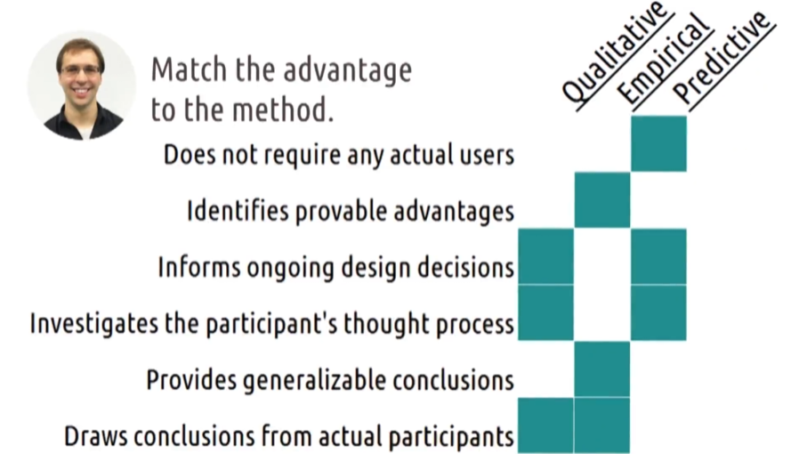

## 3.6 Evaluation

- [3.6 Evaluation](#36-evaluation)
  - [3.6.1 - Introduction to Evaluation](#361---introduction-to-evaluation)
  - [3.6.2 - Three Types of Evaluation](#362---three-types-of-evaluation)
  - [3.6.3 - Evaluation Terminology](#363---evaluation-terminology)
  - [3.6.4 - 5 Tips: What to Evaluate](#364---5-tips-what-to-evaluate)
  - [3.6.5 - Evaluation Timeline](#365---evaluation-timeline)
  - [3.6.6 - Evaluation Design](#366---evaluation-design)
  - [3.6.7 - Qualitative Evaluation](#367---qualitative-evaluation)
  - [3.6.8 - Designing a Qualitative Evaluation](#368---designing-a-qualitative-evaluation)
  - [3.6.9 - Capturing Qualitative Evaluation](#369---capturing-qualitative-evaluation)
  - [3.6.10 - 5 Tips: Qualitative Evaluation](#3610---5-tips-qualitative-evaluation)
  - [3.6.11 - Empirical Evaluation](#3611---empirical-evaluation)
  - [3.6.12 - Designing Empirical Evaluations](#3612---designing-empirical-evaluations)
  - [3.6.13 - Hypothesis Testing](#3613---hypothesis-testing)
  - [3.6.14 - Quantitative Data and Empirical Tests](#3614---quantitative-data-and-empirical-tests)
  - [3.6.15 - Special Statistical Tests](#3615---special-statistical-tests)
  - [3.6.16 - Summary of Empirical Tests](#3616---summary-of-empirical-tests)
  - [3.6.17 - 5 Tips: Empirical Evaluation](#3617---5-tips-empirical-evaluation)
  - [3.6.18 - Predictive Evaluation](#3618---predictive-evaluation)
  - [3.6.19 - Types of Predictive Evaluation](#3619---types-of-predictive-evaluation)
  - [3.6.20 - Cognitive Walkthroughs](#3620---cognitive-walkthroughs)
  - [3.6.21 - Evaluating Prototypes](#3621---evaluating-prototypes)
  - [3.6.22 - Exercise: Evaluation Pros and Cons Question](#3622---exercise-evaluation-pros-and-cons-question)
  - [3.6.22 - Exercise: Evaluation Pros and Cons Solution](#3622---exercise-evaluation-pros-and-cons-solution)
  - [3.6.23 - Exploring HCI: Evaluation](#3623---exploring-hci-evaluation)
  - [3.6.24 - Conclusion to Evaluation](#3624---conclusion-to-evaluation)### 3.6.1 - Introduction to Evaluation

[MUSIC] The heart of user-centered design is getting frequent feedback from the users. That's where evaluation comes into play. Evaluation is where we take what we've designed and put it in front of users to get their feedback. But just as different prototypes serve different functions at different stages of the design process, so also our methods for evaluation need to match as well. Early on, we want more qualitative feedback. We want to know what they like, what they don't like, whether it's readable, whether it's understandable. Later on, we want to know if it's usable. Does it actually minimize your workload? Is it intuitive? Is it easy to learn? Then at the end, we might want to know something more quantitative. We might want to actually measure, for example, whether the time to complete a task has changed, or whether the number of sales has increased. Along the way, we might also want to iterate even more quickly by predicting what the results of user evaluation will be. The type of evaluation we employ is tightly related to where we are in our design process. So in this lesson, we'll discuss the different methods for performing evaluation to get the feedback we need when we need it.

### 3.6.2 - Three Types of Evaluation

There are a lot of ways to evaluate interfaces. So to organize our discussion of evaluation, I've broken these into three categories.

1. The first is qualitative evaluation.
   - This is where we want to get qualitative feedback from users.
   - What do they like, what do they dislike, what's easy, what's hard.
   - We'll get that information through some methods very similar, in fact identical, to our methods for need finding.
1. The second is empirical evaluation.
   - This is where we actually want to do some controlled experiments and evaluate the results quantitatively.
   - For that, we need
   - many more participants,
   - and we also want to make sure we addressed the big qualitative feedback first.
1. The third is predictive evaluation.
   - Predictive evaluation is specifically evaluation without users.
   - In user centered design, this is obviously not our favorite kind of evaluation.
   - Evaluation with real users though is oftentimes slow and its really expensive. So it's useful for us to have ways we can do some simple evaluation on a day to day basis.

So we'll structure our discussion of evaluation around these three general categories.

### 3.6.3 - Evaluation Terminology

Before we begin, there's some vocabulary we need to cover to understand evaluation. These things especially applied to the data that we gathered during evaluation. While there are particularly relevant for gathering quantitative data, they're useful in discussing or other kinds of data as well.

1. The first term is reliability. Reliability refers to whether or not some assessment of some phenomenon is consistent over time.
   - So for example, Amanda what time is it? It's about 2:30. Amanda what time is it? It's about 2:30. Amanda, what time is it? It's 2:30.
   - Amanda is a very reliable assessment of the time.
   - Every time I asked, she gives me the same time.
   - We want that in an assessment measure. We want it to be reliable across multiple trials.
   - Otherwise, its conclusions are random and just not very useful.
1. A second principle is validity. Validity refers to how accurately and assessment measures reality.
   - An assessment could be completely reliable but completely inaccurate.
   - So for example, Amanda, what time is it?
   - Oh my goodness, it's 2:30! Actually it's 1:30. Oh, shoot!
   - So while Amanda was a reliable timekeeper, she wasn't a very valid one.
   - Her time wasn't correct even though it was consistent.
   - Validity is closely connected to a principle called generalizability. Generalizability is the extent to which we can apply lessons we learned in our evaluation to broader audiences of people.
   - So for example, we might find that the kinds of people that volunteer for usability studies have different preferences than the regular user.
   - So the conclusions we find that those volunteers might not be generalizable in measuring what we want to measure.
1. Finally one last term we want to know is to understand its precision. Precision is a measurement of how specific some assessment is.
   - So for example, Amanda, what time is it?
   - Well apparently, it's 1:30. Actually, it's 1:31.
   - Come on! But in this case, no one's really going to say that Amanda was wrong in saying that it was 1:30.
   - She just wasn't as precise.
   - I could just as accurately say it's 1:31:27,
   - but that's probably more precision than we need.

As we describe the different kinds of data we can gather during evaluation, keep these things in mind. If we were to conduct the same procedure again,

- how likely is it that we'd get the same results?
  - That's reliability.
- How accurately does our data actually capture the real world phenomenon that we care about?
  - That's validity.
- To what extent can we apply these conclusions to people that weren't in the evaluation?
  - That's generalizability.
- How specific are our conclusions and observations?
  - That's precision.

### 3.6.4 - 5 Tips: What to Evaluate

In designing evaluations, it's critical that we define what we're evaluating. Without that, we generally tend to bottom out in vague assessments about whether or not users like our interface. So, here are five quick tips on what you might choose to evaluate.

1. Number one, efficiency. How long does it take users to accomplish certain tasks?
   - That's one of the classic metrics for evaluating interfaces.
   - Can one interface accomplish a task in pure actions or in less time than another?
   - You might test this with predictive models or you might actually time users in completing these tasks. Still though, this paints a pretty narrow picture of usability.
1. Number two, accuracy. How many errors do users commit while accomplishing a task?
   - That's typically a pretty empirical question although we can address it qualitatively as well.
   - Ideally, we want an interface that reduces the number of errors a user commits while performing a task.
   - Both efficiency and accuracy, however, examined the narrow setting of an expert user using an interface. So, that brings us to our next metric.
1. Number three, learnability.
   - Sit under user down in front of the interface. Define some standard for expertise. How long does it take the user to hit that level of expertise?
   - Expertise here might range from
   - performing a particular action to
   - something like creating an entire document.
1. Number four, memorability.
   - Similar to learnability, memorability refers to the user's ability to remember how to use an interface over time.
   - Imagine you have a user alone in an interface,
   - then leave and come back a week later.
   - How much do they remember?
   - Ideally, you want interfaces that need only be learned once, which means high memorability.
1. Number five, satisfaction.
   - When we forget to look at our other metrics, we bought them out in a general notion of satisfaction.
   - But that doesn't mean it's unimportant.
   - We do need to operationalize it though.
   - Experience is things like
   - users enjoyment of the system or
   - the cognitive load they experience while using the system.
   - To avoid social desirability bias, we might want to evaluate this in creative ways like finding out,
   - how many participants actually download an app they tested after the session is over?

Regardless of what you choose to evaluate, it's important that you very clearly articulate at the beginning,

- what you're evaluating,
- what data you're gathering, and
- what analysis you will use.

These three things should match up to address your research questions.

### 3.6.5 - Evaluation Timeline

When we discussed prototyping,we talked about

- how over time the nature of our prototypes get higher and higher fidelity.
- Something similar happens with evaluation.
  - Over time, the evaluation method we'll use will change.
- Throughout most of our design process our evaluations are formative.
  - Meaning their primary purpose is to help us
    - redesign and improve our interface.
- At the end, though,
  - we might want to do something more summative to conclude the design process,
    - especially if we want to demonstrate that the new interface is better.
- **Formative** evaluation is evaluation with the intention of improving the interface going forward.
- **Summative** is with the intention of conclusively saying at the end what the difference was.
- In reality, hopefully we never do summative evaluation.
- Hopefully our evaluations are always with the purpose of revising our interface and making it better over time.
- But in practice, there might come times when you need to demonstrate a very clear quantitative difference.
- And because of this difference,
  - our early evaluations tend to be more qualitative.
- **Qualitative** evaluations tend to be more
  - interpretative and
  - informal.
  - Their goal is to
    - help us improve or
    - understand the task.
- Our later evaluations are likely more
  - empirical,
  - controlled, and
  - formal.
  - Their goal is to demonstrate or assess change.
- So while formative evaluation and summative evaluation were the purposes of our evaluations,
  - qualitative evaluations and empirical evaluations
    - are ways to actually fulfill those purposes.
- **Predictive** evaluation
  - is a little outside the spectrum,
  - so we'll talk about that as well.
  - As far as this is concerned,
  - predictive evaluations tend to be very similar to qualitative evaluations.
    - They inform how we revise and improve
      - our interfaces over time.
  - These three categories actually form the bulk of what we'll talk about in this lesson.
  - Recall also that earlier we talked about the difference between
    - qualitative and
    - quantitative data.
  - As you've probably realized,
    - if qualitative evaluation occurs early,
      - an empirical evaluation occurs late.
    - And chances are,
      - we're using qualitative data more early, and
      - quantitative data more late.
    - In reality, qualitative data is really always useful to improve our interfaces,
      - whereas quantitative data,
        - while always useful,
        - really can only arise when we have pretty rigorous evaluations.
- And then one last area we can look at is where the evaluation takes place.
  - In a controlled lab setting or
  - actually out in the field.
  - Generally when we're testing our early low fidelity interfaces,
    - we probably want to do it in a lab setting as opposed to out in the wild.
  - We want to
    - bring participants into our lab and
    - actually describe what we're going for,
    - the rationale behind certain decisions, and
    - get their feedback. Later on we might want to
    - do real field testing where we
    - give users a
      - somewhat working prototype, or
      - something resembling a working prototype.
    - And they can actually reflect on it as they go about their regular lives,
      - participating in whatever task that interface is supposed to help with.
  - This helps us focus exclusively on the interface early on,
    - and in transition to focusing on the interface in context later.
  - But of course we want to also think about the context early on.
    - We could for example,
      - develop a very navigation app that works great when we test in our lab,
        - because it demands a very high cognitive load.
      - But doesn't work at all out in the field
        - because when participants are actually driving,
          - they can't spare that cognitive load to focus on our app.
    - Now of course none of these are hard and fast rules.
    - We'll very likely often do qualitative evaluation late or maybe do some field testing early. But as general principles,
    - this is probably the order in which we want to think about our different evaluation styles.

### 3.6.6 - Evaluation Design

Regardless of the type of evaluation you're planning to perform, there's a series of steps to perform to ensure that the evaluation is actually useful.

1. First, we want to clearly define the task that we're examining.
   - Depending on your place in the design process this can be
     - very large or
     - very small.
   - If we were designing Facebook,
     - it can be as
       - simple as posting a status update, or as
       - complicated as navigating amongst and using several different pages.
   - It could involve
     - context and
     - constraints
     - like
       - taking notes
         - while running,
       - or looking up a restaurant address
         - without touching the screen.
     - Whatever it is, we want to start by
       - clearly identifying what task we're going to investigate.
1. Second, we want to define our performance measures.
   - How are we going to evaluate the user's performance?
     - Qualitatively, it could be based on their
       - spoken or written
         - feedback about the experience.
     - Quantitatively, we can
       - measure efficiency in certain activities or
       - count the number of mistakes.
   - Defining performance measures helps us avoid confirmation bias.
   - It makes sure we don't just pick out whatever observations or data confirm our hypotheses, or say that we have a good interface.
   - It forces us to look at it objectively.
1. Third, we develop the experiment.
   - How will we find user's performance on the performance measures?
   - If we're looking qualitatively
     - will we have them think out loud while they're using the tool?
     - Or will we have them do a survey after they're done?
   - If we're looking quantitatively
     - what will we measure,
     - what will we control, and
     - what will we vary?
   - This is also where we ask questions about
     - whether our assessment measures are
       - reliable and
       - valid.
     - And whether the users we're testing are generalizable.
1. Fourth, we recruit the participants.
   - As part of the ethics process,
     - we make sure we're recruiting participants
       - who are aware of their rights and contributing willingly.
1. Then fifth, we do the experiment.
   - We have them walk-through what we outline when we develop the experiment.
1. Sixth, we analyze the data.
   - We focus on what the data tells us about our performance measures.
   - It's important that we stay close to what we outlined initially.
   - It can be tempting to just look for whatever supports are design
     - but we want to be impartial.
   - If we find some evidence that suggests our interface is good in ways we didn't anticipate,
     - we can always do a follow up experiment to test if we're right.
1. Seventh, we summarize the data in a way that
   - informs our on going design process.
     - What did our data say was working?
     - What could be improved?
   - How can we take the results of this experiment and use it to then revise our interface?
   - The results of this experiment then become part of our design life cycle.
   - We
     - investigated user needs,
     - develop alternatives,
     - made a prototype and
     - put the prototype in front of users.
   - To put the prototype in front of users,
   - we walked through this experimental method.
   - We defined the task,
     - defined the performance measures,
     - developed the experiment,
     - recruited them,
     - did the experiment,
     - analyzed our data and
     - summarized our data.
   - Based on the experience,
     - we now have the data necessary
       - to develop a better understanding of the user's needs,
       - to revisit our earlier design alternatives and
       - to either improve our prototypes by increasing their fidelity or
         - by revising them based on what we just learned.
     - Regardless of whether we're doing
       - qualitative,
       - empirical, or
       - predictive evaluation,
     - these steps remain largely the same.
   - Those different types of evaluation just fill in the experiment that we develop, and they inform our performance measure, data analysis, and summaries.

### 3.6.7 - Qualitative Evaluation

Qualitative evaluation involves getting qualitative feedback from the user.

There are a lot of qualitative questions we want to ask throughout the design process.

- What did you like?
- What did you dislike?
- What were you thinking while using this interface?
- What was your goal when you took that particular action?

Now, if this sounds familiar, it's because it should be. The methods we use for qualitative evaluation are very similar to the methods we used for need-finding:

- interviews,
- think-aloud protocols,
- focus groups,
- surveys,
- post-event protocols.

We use those methods to get information about the task in the first place, and now, we can use these techniques to get feedback on how our prototype changes the task.

### 3.6.8 - Designing a Qualitative Evaluation

Let's run through some of the questions you'll have to answer in designing a qualitative evaluation.

1. **First, is this based on prior experience, or is it a live demonstration?**

- If you're bringing in users to answer questions about some interface that they're already using regularly,
  - I'd probably argue you're actually doing need-finding.
- Now, the distinction can be subtle because evaluation does lead to additional need-finding,
  - but most of these questions are going to apply more to a live demonstration.
    - This is where you're bringing users in to test out some new interface for new prototype.

1. **Second, is the session going to be synchronous or asynchronous?**

- In a synchronous session,
  - you're sitting and watching the user live.
  - You're actually watching them use this interface you use in this prototype.
- If they're going to complete it on their own and just send you the results, and then it's an asynchronous session.
- Synchronous is usually beneficial because
  - we see a much greater amount of the interactions taking place.
  - We might also be able to interrupt the user and get their thoughts live.
- Asynchronous, though is often much easier to carry out,
  - especially with larger populations.
- I generally recommend synchronous whenever possible,
  - but asynchronous is certainly better than nothing.

1. **Third, how many prototypes or how many interfaces will they be evaluating?**

- You might have users come in to evaluate only one interface,
  - or you might have them look at multiple prototypes to compare between them.
- If you're having them look at more than one prototype,
  - you want to make sure to vary the order in which you present them,
  - otherwise, you might get consistently different feedback just because the user is already familiar with the problem domain when they get to the second interface.
- That can be particularly significant if you're trying out some new interface compared to an interface that you've used in the past.
- If you always present the old first,
  - then you'll probably get a lot of users saying the new one is much better,
    - when in reality, they're just more familiar with the problem now.

1. **Fourth, when do you want to get feedback from the user?**

- There are two main protocols for doing this.There's a Think Aloud Protocol and a Post-Event Protocol.
  - **In a Think Aloud Protocol,**
    - you ask the user to actually think out loud while they're using your interface or prototype.
    - You ask him to explain what they're seeing and explain how they interpreted, and
    - explain what they think the outcome of their actions will be.
  - **In a Post-Event Protocol,**
    - you have the user go through some session using the interface or testing out the prototype,
      - and then only giving you thoughts at the end.
  - **A Post-Event Protocol has the drawback,**
    - that you're only getting the user's feedback at the end.
      - So, if they experience some difficulty early on,
        - they may have forgotten it by the time you actually get feedback from them, but
  - **a Think Aloud Protocol has a problem in that**
    - it might introduce some new biases.
    - Research shows that when users are asked to think out loud while using an interface,
      - the way they use the interface actually changes.
        - They're more deliberative.
        - They're more thoughtful.
        - They're less intuitive about their interactions.
      - In general, what that means, is that when we ask users to think out loud about an interface,
        - oftentimes, they'll figure out how the interface works, but then,
      - if users use the same interface without having to think out loud,
        - they find it much more confusing.
        - Talking through their thought process helps them understand, but
          - our real end-users aren't going to talk through their thought process, so
  - it's often good to use a mix of these two.
    - In fact, I'd usually suggest
      - doing a Think Aloud Protocol earlier, and
      - using a Post-Event Protocol more as a summative evaluation
        - once you're already pretty confident in how good your interface is,
      - but others advice may differ. In either case, it's worth noting that
  - users are not often very good at explaining
    - why they like something or
    - why they did something,
    - so we should always take the feedback that we get with a grain of salt.

1. **Finally, do you want to get feedback from individuals or from groups?**

- Focus groups
  - are used when multiple users talk together about their experiences.
  - This can actually lead to better explanations,
    - because users build on each other and expand each other's ideas,
  - but it can also strongly bias the group towards the opinions of the most powerful personalities.
- Individual interviews and surveys

  - force the user to be the only source of knowledge,
    - which can be bad, but it also means
    - the user isn't biased by other outside views.

- As you'll notice and has probably become a trend,
  - whenever we talk about multiple different options for doing
    - evaluation or
    - need-finding or
    - whatever,
  - different approaches have
    - different strengths, and they
    - address the weaknesses of other approaches.
- So, generally, if you're going through multiple iterations of the design life cycle,
  - you'll probably use all of these different ideas at different times.

### 3.6.9 - Capturing Qualitative Evaluation

With qualitative research,

- we want to capture as much of the session as possible.
  - Because things could come up that we don't anticipate.
  - And we'd like to look at them again later.
- So how do we do that?

1. One way is to actually record the session.
   - The pros of recording a session are that
     - it's automated,
     - it's comprehensive, and
     - it's passive.
   - Automated means that it runs automatically in the background.
   - Comprehensive means that it captures everything that happens during the session. And
   - passive means that it lets us focus on administering the session instead of capturing it.
     - The cons though, are that
       - it's intrusive,
       - it's difficult to analyze, and
       - it's screenless.
     - Intrusive means that many participants are uncomfortable being videotaped.
       - It creates oppression knowing that
         - every question or
         - every mistake
         - is going to captured and analyzed by researchers later.
     - Video is also very difficult to analyze.
       - It requires a person to
         - come later and watch
           - every minute of video,
             - usually several times,
         - in order to
           - code and
           - pull out
           - what was actually relevant in that session.
     - And video recording often has
       - difficulty capturing interactions on-screen.
     - We can film what a person is doing on a keyboard or with a mouse,
       - but it is difficult to then see how that translates to on-screen actions.
     - Now some of these issues can be resolved, of course.
     - We can do video capture on the screen synchronize it with a video recording.
     - But if
       - we're dealing with
         - children, or
         - at risk populations, or
         - with some delicate subject matter,
       - the intrusiveness can be overwhelming.
       - And if we want to do a lot of complex sessions,
         - the difficulty in analyzing that data can also be overwhelming.
           - For my dissertation work I captured about 200 hours of video,
             - and that's probably why it took me an extra year to graduate.
       - It takes a lot of time to go through all that video.
1. So instead we can also focus on note-taking.

- The benefits of note-taking are that
  - it's very cheap,
  - it's not intrusive, and
  - it is analyzable.
- It's cheap
  - because we don't have to buy expensive cameras or equipment,
  - we just have our pens and papers or our laptops, or anything like that.
  - And can just do it using equipment we already have available to us.
- It's not intrusive,
  - in that it only captures what we decide to capture.
    - If a participant is uncomfortable asking questions or makes a silly mistake with the interface,
      - we don't necessarily have to capture that,
        - and that can make the participant feel a little bit more comfortable being themselves. And
- it's a lot easier to analyze notes.
  - You can scroll through and read the notes on a one hour session in only a few minutes.
    - But analyzing that same session in video is certainly going to take at least an hour, if not more, to watch it more than once.
- But but of course there are draw backs too.
  - Taking those can be a very slow process,
    - meaning that we can't keep up with the dynamic interactions that we're evaluating.
  - It's also manual
    - which means that we actually have to focus on actively taking notes,
      - which gets in the way of administering the session.
- If you're going to use note taking,
  - you probably want to actually have two people involved.
    - One person running the session, and
    - one person taking notes.
- And finally,
  - it's limited in what it captures.
    - It might not capture some of
      - the movements or
      - the motions
      - that a person does when interacting with an interface.
  - It doesn't capture how long they hesitate before deciding what to do next.
  - We can write all that down of course, but we're going to run into the limitation of how fast we can take notes.
  - It would be nearly impossible to simultaneously take notes on
    - what questions the user is asking,
    - how long they're taking to do things, and
    - what kind of mistakes they're making.
    - Especially if we're also responsible for administering the session at the same.

1. A third approach if we're designing software, is to actually log the behavior inside the software.

- This is in some ways, the best of both worlds.
  - Like video capture,it's
    - automatic and
    - passive, but
  - like note taking,
    - it's analyzable.
      - Because it's run to the system itself,
        - it automatically captures everything that it knows how to capture, and
          - it does so without our active invention.
    - But it likely does so in a data or text format,
      - that we can then either analyze manually by reading through it, or
      - even with some more complicated data analytics methods.
- So in some ways, it captures the pros from both
  - note-taking and
  - video capture.
- But it also has its drawbacks as well. Especially,
  - it's very limited.
    - We can only capture those things that are actually expressed inside the software.
      - Things like the questions that a participant asks wouldn't naturally be captured by software logging. Similarly,
    - it only captures a narrow slice of the interaction.
      - It only captures what the user actually does on the screen.
        - It doesn't capture how long they look at something.
    - We might be able to infer that by looking at the time between interactions,
    - but it's difficult to know if that hesitation was because
      - they couldn't decide what to do,
      - or because someone was making noise outside,
      - or something else was going on.
  - And finally, it's also very tech sensitive.
    - We really have to have a working prototype, in order to use software logging. But remember, many of our prototypes dont' work yet.
  - You can't do software logging on
    - a paper prototype, or
    - a card prototype, or
    - a Wizard of Oz prototype.
    - This only really works once we've reached a certain level of fidelity with our interfaces.
- So in selecting a way to capture your qualitative evaluation,
  - ask yourself,
    - will the subjects find being captured on camera intrusive?
    - Do I need to capture what happens on screen?
    - How difficult will this data be to analyze?
- It's tempting, especially for novices,
  - to focus on just capturing as much as possible during the session.
- But during the session is when you can capture data in a way that's going to make your analysis easier.
- So think about the analysis that you want to do, when deciding how to capture your sessions.

### 3.6.10 - 5 Tips: Qualitative Evaluation

Here are five quick tips for conducting successful evaluations.

1. Number one, run pilot studies.
   - Recruiting participants is hard.
     - You want to make sure that once you start working with real users,
       - you're ready to gather really useful data.
     - So, try it your experiment with
       - friends or
       - family or
       - co-workers
       - before trying it out with real users
         - to iron out the kinks in your design and your directions.
1. Number two, focus on feedback.
   - It's tempting in qualitative evaluations to spend too much time trying to teach this one user.
   - If the user criticizes an element of the prototype,
     - you don't need to explain to them the rationale.
   - Your goal is to get feedback to design the next interface,
     - not to just teach this one current user.
1. Number three, use questions when users get stuck. That way,
   - you get some information on
     - why they're stuck, and
     - what they're thinking.
   - Those questions can also be used to guide users
     - to how they should use it to make the session seem less instructional.
1. Number four, tell users what to do, but not how to do it.
   - This doesn't always apply,
     - but most often we want to design interfaces that users can use without any real instruction whatsoever.
   - So, in performing qualitative evaluation,
     - give them instruction on what to accomplish,
       - but let them try to figure out how to do it.
     - If they try to do it differently than what you expect,
       - then you know how to design the next interface.
1. Number five, capture satisfaction.
   - Sometimes, we can get so distracted by
     - whether or not users can use our interface that
       - we forget to ask them whether or not they like using our interface.
   - So, make sure to capture user satisfaction in your qualitative evaluation.

### 3.6.11 - Empirical Evaluation

- In an empirical evaluation, we're trying to evaluate something formal, and most often that means something numeric.
  - It could be something explicitly numeric like what layout of buttons leads to more purchases or what gestures are most efficient to use.
- There could also be some interpretation involved though like counting errors or summarizing survey responses.
- The overall goal though is to come to the something verifiable and conclusive.
- In industry, this is often useful in comparing designs or in demonstrating improvement.
- In research though, this is even more important, because this is how we build new theories of how people think when they're using interfaces.
- If we wanted to prove, for example, that gestural interaction has a tougher learning curve than voice interaction, or that an audio interface is just as usable as a visual one,
  - we would need to do empirical evaluation between the interfaces.
- Now, most empirical evaluations are going to be comparisons.
- We can do quantitative analysis without doing comparisons, but it usually isn't necessary.
- The biggest benefit of quantitative analysis is the ability to help us perform objective comparisons.
- So, with empirical evaluation, our overall question is usually,
  - how can we show that there is a difference between these designs?

### 3.6.12 - Designing Empirical Evaluations

- When we do qualitative evaluations,
  - we effectively just
    - bring in participants one at a time or maybe in groups,
    - go through a certain interview protocol or script, and
    - then move them along.
  - Empirical evaluation is different though.
  - Here, we have multiple conditions which we call treatments.
  - These treatments
    - could be different
      - interfaces, different
      - designs, different
      - colors,
      - whatever we're interested in investigating.
  - Our goal here is to investigate the comparison between the treatments and end up with a conclusion about how they are different.
  - However, we have to be careful to make sure that the differences that we observe really are due to differences between the treatments and not due to other factors.
  - For example, imagine we're testing the difference between two logos, and we want to know what works better, orange or teal.
    - However, we also make one a circle and the other one a triangle.
    - In the end, we wouldn't be able to comment on orange versus teal.
    - We can only comment on orange circle versus teal triangle.
    - To make a judgement about the color,
      - we need to make sure that the color is the only thing that we're comparing.
    - Of course, this example right here sound a little bit silly.
    - In practice though, differences can be more subtle.
  - If you're testing between different layouts, you might missed that one loads a bit faster or that one uses prettier images, and that could actually account for any differences that you observe.
  - Once we've designed the treatments, it's time to design the experiment itself.
    - Our first question is, what do the participants do? Does each participant participate in one treatment or both?
      - If each participant only participates in one treatment, then our next step is pretty easy.
      - We split the participants randomly into two groups, and one by one, they each go through their treatment.
      - At the end, we have the data from participants in one group to comparative data from participants in the other group.
    - This is a between subjects design,
      - we're comparing the data from one group to the other group.
    - There's a second option though, we can also do a within subjects experiment.
      - With a within subjects experiment, each participant experiences both treatments.
  - However, a major lurking variable could potentially be,
    - which treatment each participant sees first?
  - So, we still have to randomly assign participants to treatment groups.
  - But instead of assigning participants to which treatment they are receiving, we're randomly assigning them to what order they'll receive the treatments in.
    - That way, if the order of the participants received the treatments in matters, we'll see it in our data.
  - Within subject is beneficial because it allows us to gather twice as much data if our participant pool is limited.
    - Here, each interface would be used by 16 participants instead of just eight.
    - It also allows us to do within subjects comparison,
      - seeing how each individual participant was affected, instead of the groups as a whole.
    - That can help us identify some more subtle effects, like, if different people have different strengths.
    - However, within subjects requires more of our subjects time, which can be a big problem if the treatments are themselves pretty long.
  - Throughout this example, we've also glossed over important detail.
  - Random assignment. Random assignment to treatment helps us control for other biases.
    - Imagine if all the smartest participants or all the women were all placed in one group and all receive the same treatment,
      - that would clearly affect our results.
    - That's why we randomly assign people to groups.
    - Now, that might sound obvious, but imagine if you're treatment involves a physical setup,
      - it would be tempting to run the first eight participants on one setup and a second eight participants on the other, so you don't have to switch back and forth between them.
      - But what if that means that all the more punctual participants were in the first condition, or what if you got better at administering the experiment during the first condition?
        - So that participants in the second condition had a generally smoother experience.
    - All of these looking variables are controlled in part, by random assignment to groups.

### 3.6.13 - Hypothesis Testing

- Let's pretend this is a reaction time study because that gives us some nice numeric data.
  - We're curious, what color should be used to alert a driver in a car that they're starting to leave their lane?
- We run half of them with orange, and half of them with green in a between subjects design.
  - As a result, they've generated some data.
  - These are each participant's reaction times.
  - Our goal is to compare this data and decide which is better.
  - So, how do we do that?
    - Well, we might just average it.
      - So, it looks like the orange is smaller than the green, right?
        - So, the orange is better, and not so fast, no pun intended.
    - These numbers are very close. It's entirely possible this difference arose just by random chance.
    - They're not likely going to be exactly equal in any trial.
    - The question is are they different enough to conclude that they're really different? In fact, in this case, they definitely are if you run the numbers.
  - The process for actually doing this rigorously is called hypothesis testing.
  - Whenever we're trying to prove something, we initially hypothesized that the opposite is true.
    - So, if we're trying to prove that one of these options is better than the other, we initially hypothesized that actually, they are equal.
      - That's the null hypothesis.
      - It's the hypothesis that we accept if we can't find sufficient data to support the alternative hypothesis.
    - So, we want to see if this difference is big enough to accept the alternative hypothesis instead of the null hypothesis.
      - We generally accept the alternative hypothesis if there's less than a five percent chance that the difference could have arisen by random chance.
      - In that case, we say that the difference is statistically significant.
    - So, here, there's probably a pretty good chance that this difference could arise by random chance,
      - not because orange is actually any better than green.
      - But imagine if the data changed.
      - Imagine if these were our observations from green instead of the ones before.
      - Our average has gone up considerably from 0.3 to 0.44.
      - Here, it's unlikely for this difference to be based only on random chance.
      - It's still possible. It's just far less likely.
- This is the general process of hypothesis testing.
  - Assuming that things are the same and seeing if the data is sufficient to prove that they're different.

### 3.6.14 - Quantitative Data and Empirical Tests

- Null and alternative hypotheses are common to all kinds of hypothesis tests.
  - The specific kind of hypothesis tests you conduct however, depends on the kind of data that you have.
- Recall when we first started talking about quantitative data, we discussed
  - four general kinds:
    - Nominal,
    - ordinal,
    - interval and
    - ratio.
- What kinds of hypothesis tests we use will depend on what kind of data we've collected.
- Note that my goal here isn't for you to know off the top of your head how to do each of these tests.
  - Instead, I want you to know when to use each kind of test.
  - So, you can go and look it up when needed.
  - I've used all these kind of tests before and I can't remember off the top my head how to do any of them.
  - But I know when to go look up which test and that's the most important thing for now.
- For nominal data,
  - we generally want to do something called a Chi-squared test.
  - A Chi-squared test checks to see if the distribution of values to a number of buckets is the same across two conditions.
  - For all of these, I'm going to use a series of examples inspired by comparison that I did recently between my online undergraduate course and in traditional undergraduate course.
  - So for example, one of my questions was, does the distribution of majors differ between the online section and the traditional section?
    - Here our independent variable would be a pair of categories.
      - For me it's online and traditional,
    - and our dependent variable will be the distribution among some other set of categories,
      - here it's majors.
    - We always assume that the distributions are equal.
      - So, our alternative hypothesis would be the distributions are unequal.
    - Now, obviously the distributions are unequal in some ways.
      - There's a lot more students in traditional section.
      - That ratio isn't perfectly mirrored across all these categories.
    - Our question is, are these differences big enough to assume that it's an actual difference between online and traditional?
      - Or, are the differences just a product of random noise?
    - If there are four times as many students in the traditional section as the online section,
      - then we wouldn't expect exactly four times as many computer science majors and exactly four times as many math majors.
      - But we also wouldn't expect the ratios to be way off either.
      - So, a Chi-squared test lets us test to see whether distributions to this categories are comparable.
- For ordinal data,
  - we actually go with a very similar process. Just like with nominal data, we have our different categories as our independent variable and our dependent variable is some distribution among a number of categories.
    - The difference here is that these categories are ranked.
  - What that means is we could actually use the exact same test. We could use the Chi-squared test.
  - The weakness there is that the Chi-squared test isn't as sensitive to systematic changes across these categories.
  - The Chi-squared test assumes all these different categories are independent.
  - We know though that if we see a small shift in all the categories from left to right, that might actually be a significant difference between the two sections.
  - So, it's generally better to use what's called the Kolmogorov-Smirnov test.
    - It's very similar to the Chi-squared test but it's sensitive to the fact that those categories are ordered.
  - Now that said, using the Chi-squared test isn't going to hurt you with this kinda data and sometimes it can be easier to run.
  - There's also an alternative that more simply just test to see whether it's likely that the medians of the two are different.
  - It's also not terribly uncommon to make the assumption that these ordinal data categories are evenly spaced.
  - Now, remember when we talked about ordinal data and that was exactly one of the weaknesses that we noted.
    - We noted that we can't know the difference between highly dissatisfied and dissatisfied, is the same as the difference between dissatisfied and neutral.
    - Because we can't know that, we're really not supposed to just average these but in practice it's not uncommon for people to do so anyway.
    - In that case, we might just assign these categories numbers like one, two, three, four and five, multiply the number of observations by those numbers, average them over the number of actual respondents and see if there's a statistically significant difference.
  - It's not good to do that but if you chose to do that you wouldn't be the first person ever to do so.
  - When we get to interval and ratio data, the kinds of tests we use actually shift a good bit.
    - First, we really never treat interval and ratio data as different.
      - The fact that ratio data has a zero-point and interval data doesn't, doesn't affect any of our statistical tests.
      - The statistical tests that we do for this kind of data are always dependent on the average and the standard deviation.
- The most common test is called the Student's t-test.
  - I'm not going to talk about it right now but I do recommend looking up why it's called the Student's t-test.
  - It's kind of an interesting story.
- For these are independent variable, is the same as it's been in the past.
  - It's a category we're comparing between two different populations.
- But our dependent variable is actually just the average of some kind of outcome.
  - We're not talking about distributions into subcategories but rather just looking at a certain outcome for all participants in each category.
- Our null hypothesis is that the outcomes are equal and our alternative hypothesis is that the outcomes are unequal.
- A t-test lets us pretty straightforwardly compare between the two and see if the difference is actually statistically significant.
  - Again, we wouldn't expect the two numbers to have to be exactly identical to say that the populations are not any different.
  - Here, an average of 10.2 compared to the online section did any better than the traditional section especially when the standard deviations are pretty significant fractions of those averages.
  - Don't worry though if you don't fully understand the math behind this, you're really not supposed to right now.
  - For now all you really need to know is that the difference has to be big enough to justify that one is actually different from the other and how big, big enough actually is, is dependent on how big that standard deviation is.
    - The bigger the standard deviation, the bigger the difference needs to be.
- Now it's also worth noting that we're only supposed to use t-tests when the data distribution is normal.
  - That means it mirrors irregular bell-curve.
- If it's not normal, we're supposed to use things like the Mann-Whitney-Wilcoxon test or the Kruskal-Wallis Test.
  - But those topics are kind of outside our scope.
- Generally speaking, a Chi-squared test and a t-test will get you most of what you need at least until we get to having three different levels of our independent variable.

### 3.6.15 - Special Statistical Tests

- Chi-squared tests and t-tests are probably the most commonly used tests in HCI. However,
  - there are some assumptions embedded in the ones we just looked at.

1. First, notice that we only ever had two levels to our independent variable.
   - We were only ever comparing online and traditional students.
   - For your work, that might mean only comparing two different interfaces.
   - What if we wanted to test three?
     - How can we do that?
   - Imagine for example, I wanted to test these two classes against a third class or flipped class.
     - Here we'd be testing the online section versus the traditional section versus the flipped section, how would we do that?
       - You might be tempted to just test them in a pairwise fashion, test online versus traditional, traditional verse flipped and online verse flipped.
   - You use that to try to uncover any differences between pairs. That's called repeated testing, and the problem, is that it raises the likelihood of a type one error.
   - **A type one error is also called a false positive**,
     - and it's where we falsely reject the null hypothesis.
     - In other words, we falsely say that we have enough data to conclude the alternative hypothesis.
     - Here that would mean, falsely concluding that there is a difference when there isn't actually a difference.
     - The reason repeated testing raises likelihood of this, is that remember we said that we reject the null hypothesis if there's generally less than a five percent chance it could have occurred by random chance.
     - But if you do three different tests, you raise the likelihood of one of them turning up conclusive even though it really isn't.
     - Think of it like playing the lottery.
       - If I say you have a one in 20 chance of winning and you play 20 times,
         - you'll still win once.
       - That's because your overall odds of winning increased.
       - Performing multiple tests, raises our overall likelihood of finding a false positive.
       - So instead, what we need, is a single test that can compare against all these different treatments at once.
     - Now fortunately, for ordinal or nominal data, it's actually just the same test.
       - A chi-squared test can handle more than just two levels of our independent variable.
         - Our alternative tests change a little bit, if we're dealing with more than two levels.
         - The weakness here, is if we do a Chi-squared test on all three of these levels at once,
           - all it will tell us is if there's any difference between any of the levels.
       - It doesn't tell us where the difference is.
         - So, if this chi-squared test shows that there is a difference, we don't have any way of knowing, is it the difference between the online and traditional, online and flipped, traditional and flipped, or is it a case where the flipped is different from both the online and traditional or something like that.
       - So, generally what we do, is we do an overall chi-squared tests on all of the levels, and then we can follow up if that first test was successful with a pairwise comparison between the conditions.
       - In that case, for basically concluding that we know there's a difference before we actually do the repeated testing.
       - So, the overall odds of finding a false positive aren't changing.
1. For interval and ratio data though, we need to use a different test altogether.
   - This test is called an analysis of variance or ANOVA.
     - A one-way ANOVA test, let's us compare between three or more groups simultaneously.
     - Here, that means we could test between all three of our classes at the same time. For you that can mean guessing between three or four interfaces at the same time.
     - With a two-way ANOVA, we could actually take this a step further. We could have two dimensions of independent variables, we could test online traditional and flipped against upper class mean versus lower-class mean. We could actually get it differences like, do freshmen do better at online but sophomores do better in traditional.
     - The weakness though, is the same as the weakness with the chi-squared test, and analysis of variance will tell us if there are differences, but it won't tell us where the differences are.
   - Our approach to that is the same as it was with the chi-squared test as well. If the analysis of variance indicates there's an overall difference, then we can follow up with pairwise t-tests.
   - Notice though, there's still one assumption that's been embedded in every single analysis we've talked about.
     - Our independent variables have always been categorical, that's generally true for most of the tests we're going to do.
     - If we're testing one interface against another, then those are our two categories.
     - If we're testing one body of people against another, then those are our two categories.
     - So, this isn't really a weakness or a challenge, but there are cases where we want our independent variable to be something non-categorical.
   - Mostly that happens when we want our independent variable to be some interval or ratio data.
     - So, imagine for example I wanted to see if GPA was a good predictor of course grade.
     - GPA though is generally considered interval data, we might consider it ratio data but it's usually discussed as interval data.
     - We could do this by breaking GPA down into categories.
       - Instead of this, we could
         - average the course grades for anyone with a GPA from 3.5-4,
         - Or we could leave the GPA is interval data, and just do a direct analysis.
       - Generally, here we'd be doing a regression or we would see how well one variable predicts another.
       - Most of our regressions are linear, but we could also do
         - a logistic regression,
         - a polynomial regression, and
         - lots more.
     - Again, I'm getting outside the scope of our class.
       - Here, our null hypothesis is that the variables are unrelated, and our alternative hypothesis is that they are related.
         - So, we need evidence that they're related before assuming that they are.
         - Here things get a little bit more complex as well, because we're not quite as emphatic about how we reject our null hypothesis and accept our alternative hypothesis.
         - Usually with regressions, we describe how well the two fit. They might fit very well, somewhat well, not well at all, and so on.
   - Before we move on, there's
1. one last type of data I'd like to talk about, and that's binomial data.
   - Binomial data is data with only two possible outcomes, like a coin flip.
   - For us we might have outcomes like success in a class.
   - In HCI, we might be curious which of multiple interfaces allows users to succeeded a task with greater frequency.
   - Notice there that, success and failure are binary, and that's what makes this binomial data.
     - What can be tricky here, is that our data actually looks continuous, it looks just like straightforward continuous ratio data.
   - Here we might say online students succeed 94.9 percent of the time, in traditional students succeed 92.1 percent of the time, and we might be tempted just to do a straightforward t-test on that.
     - But if you try to do the math, you'll quickly find that it doesn't work.
   - A t-test requires a standard deviation, and if every single student is either a one or a zero, a success or a failure, then you don't really have a standard deviation in the same way.
   - So instead, we have a specific tests that we use for binomial data called a binomial test.
     - With a two sample binomial test, we compare two different sets of trials, each with a certain number of successes.
       - So, we can answer questions like;
         - does one lead to a greater ratio of successes than the other?
     - Alternatively, we can also do a one-sample binomial test.
       - That's where we compare only one set of trials to some arbitrary number.
       - So, for example. If we wanted to prove that a coin was unbalanced, we would use a one-sample binomial test comparing it to a ratio of 50 percent.
   - You'll know that you want to use binomial data, if the individual observations you're getting out of users are binary.
     - If you're only concerned with whether they succeeded or failed on a particular task and if your data is just a bunch of instances of successes and failures, then you're using binomial data.
   - If the data you're getting out of your users is more complex like multiple categories or continuous observations, then you're probably looking at using a chi-squared test or a t-test or any of the ones we talked about before.
   - Now, we've gone through a lot of tests and we've gone through them very quickly, but remember our goal is just for you to know what test to use and when.
     - Once you've identified the appropriate test, looking at how to do it and actually putting the data in, is usually a much simpler task.

### 3.6.16 - Summary of Empirical Tests

- Because the only goal here is for you to be able to identify what test to use and when,
  - we've put together this little chart to serve as kind of a cheat sheet.
- Here, you can look up
  - your independent variable,
  - your dependent variable and
  - your number of treatments and
  - see what test is recommended.
- So, if you've gathered some categorical ordinal data, with three or more treatments,
  - I'd probably want to use a Chi-squared test.
  - Now of course, you'll also notice that this isn't exhaustive.
- There are a lot of combinations of independent and dependent variables you could have that aren't covered here.
- For example, we never talked about how you do a binomial test with three or more treatments.
- You might also have tests for the independent variables interval or ratio but your deep in the variable is still nominal or ordinal or something else.
- So, there are a lot of things out there in the statistical community that aren't covered here.
- But these tests and these combinations of variables, tend to be the ones that we encounter most often in HCI.
- Even there, this is probably overkill.
  - A Chi-squared test,
  - a T-test and
  - the occasional ANOVA
- will probably last you your entire career. At least for the types of analyses that we usually care about.

### 3.6.17 - 5 Tips: Empirical Evaluation

Here are five quick tips for doing empirical evaluations. You can actually take entire classes on doing empirical evaluations, but these tips should get you started.

1. Number one, control what you can, document what you can't.
   - Try to make your treatments as identical as possible.
   - However, if there are systematic differences between them, document and report that.
1. Number two, limit your variables.
   - It can be tempting to try to vary lots of different things and monitor lots of other things, but that just leads to noisy difficult data that will probably generate some false conclusions.
   - Instead, focus on varying only one or two things and monitor only a handful of things in response. There's nothing at all wrong with only modifying one variable and only monitoring one variable.
1. Number three, work backwards in designing your experiment.
   - A counter state that I've seen is just to gather a bunch of data and figure out how to analyze it later.
   - That's messy, and it doesn't lead to very reliable conclusions.
   - Decide at the start what question you want to answer, then decide the analysis you need to use, and then decide the data that you need to gather.
1. Number four, script your analyses in advance.
   - Ronald Coase once said, "If you torture the data long enough, nature will always confess."
   - What the quote means is If we analyze and reanalyze data enough times, we can always find conclusions, but that doesn't mean that they're actually there.
   - So, decide in advance what analysis you'll do and do it.
   - If it doesn't give you the results that you want, don't just keep reanalyzing that same data until it does.
1. Number five, pay attention to power.
   - Power refers to the size of the difference that a test can detect.
   - Generally, it's very dependent on how many participants you have.
   - If you want to detect only a small effect, then you'll need a lot of participants.
   - If you only care about detecting a big effect, you can usually get by with fewer.

### 3.6.18 - Predictive Evaluation

- Predictive evaluation is evaluation we can do without actual users.
  - Now, in user centered design that's not ideal,
    - but predictive evaluation can be more
      - efficient and
      - accessible
      - than actual user evaluation.
    - So it's all right to use it
      - as part of a rapid feedback process.
    - It lets us
      - keep the user in mind, even
        - if we're not bringing users into the conversation.
- The important thing is to make sure we're using it appropriately.
- Predictive evaluation shouldn't be used where we could be doing
  - qualitative or
  - empirical evaluation.
- It should only be used where we wouldn't otherwise be doing any evaluation.
- Effectively, it's better than nothing.

### 3.6.19 - Types of Predictive Evaluation

When we talk about design principles, we talked about several heuristics and guidelines we use in designing interfaces.

- The first method for predictive evaluation is
  - simply to hand our
    - interface and
    - these guidelines
    - to a few experts to evaluate.
- This is called heuristic evaluation.
- Each individual evaluator
  - inspects the interface alone, and
  - identifies places where the interface violates some heuristic.
- We might sit with an expert while
  - they perform the evaluation or
  - they might generate our report.
- Heuristics are useful because they
  - give us small snapshots into the way people might think about our interfaces.
- If we take these heuristics to an extreme though,
  - we could go so far as to develop models of the way people think about our interfaces.
- During our need-finding exercises,
  - we developed models of our users tasks.
- In model-based evaluation,
  - we take these models and
    - trace through it in the context of the interface that we designed.
- **So, let's use a GOMS model for example,**
  - just we computed a GOMS model for what users data in some context,
    - we can also compute a GOMS model for what they will do in our new interface.
    - Then, we can compare these models side-by-side to see
      - how our interface changes the task and
      - evaluate whether a deficiency.
  - So here, the classical way of disabling an alarm was to use a keypad mountain near the door.
    - We could use this GOMS model to evaluate
      - whether or not the new keychain interface
        - was actually more efficient than the keypad interface.
- **We can also use the profiles of users that we developed**
  - to evaluate whether the new design meets each criteria.
    - For example, imagine if we identified this model
      - as applying to users with low motivation to use this interface?
    - Maybe it's people doing purchases that they have to do for work,
      - as opposed to just shopping at their leisure.
  - We can use that to inform our evaluation of whether or not the interface relies on high user motivation.
  - If we find that the interface requires
    - users to be more personally driven
    - or to keep more in working memory,
    - then we might find that the users will fail
      - if they don't have high motivation to use the interface,
      - and then we can revise it accordingly.
- If we take model-based evaluation to an extreme though, we can actually get to the point of
  - simulation-based evaluation.
    - At that point, we might construct an artificially intelligent agent that interacts with our interface in the way that a human would.
  - Melody Ivory and Marti Hearst actually did some research on this back in 2001,
    - on The State of the Art In Automating Usability Evaluation of User Interfaces.
      - That seems like an amazing undertaking given how
        - flexible and varied user interfaces can actually be.
  - Can we really evaluate them automatically?
    - More recently, work has even been done to create even more human-like models of users,
      - like some work done by the Human-Centered Design Group at the Institute for Information Technology in Germany.
    - Developing that agent is an enormous task on it's own, but if
      - we're working on a big long-term project like Facebook or
      - in a high-stakes environment like air traffic control,
      - having a simulation of a human that
        - we can run hundreds of thousands of times on different interface prototypes would be extremely useful.

### 3.6.20 - Cognitive Walkthroughs

The most common type of predictive evaluation you'll encounter is most likely the cognitive walkthrough.

- In a cognitive walkthrough,
  - we stepped through the process of
    - interacting with an interface,
    - mentally simulating in each stage what the user is seeing and thinking and doing.
      - To do this, we start by constructing specific tasks that can be completed within our prototype.
    - So I'm going to try this with the card prototype that I used with Morgan earlier.
      - I start with some goal in mind.
        - So right now, my goal might be to leave a note while listening.
      - I look at the interface and
      - I try to imagine myself as a novice user.
      - Will they know what to do?
      - Well, here's a button that says
        - View and Take Notes, and
      - if they want to take a note,
        - I think that's reasonable to assume that they would know to do that.
      - So I tap that button and what response do I get?
      - Well, that's when this screen will come up.
        - The system will pause playback first and
          - then it will show me the note-taking screen,
      - and I go through the entire system like this,
        - predicting what actions the user will take and
        - noting the response of the system will give.
      - At every stage of the process,
        - I want to investigate this from the perspective of the gulfs of
          - execution and
          - evaluation.
      - Is it reasonable to expect the user to cross that gulf of execution?
        - Is the right action sufficiently obvious?
        - Is a response to the action, the one the user would expect?
      - Now on the other side, is it reasonable to expect the feedback to cross the gulf of evaluation?
        - Does the feedback show the user what happened?
        - Does the feedback confirm the user chose the right action?
  - Now, the weakness of cognitive walkthroughs is that
    - we're the designers,
      - so it likely seems to us like the design is just fine.
      - After all, that's why we designed it that way.
  - But if you can sufficiently put yourself in the user's shoes,
    - you can start to uncover some really useful takeaways.
  - So, here for example,
    - from this cognitive walkthrough, I've noticed that there isn't sufficient feedback when the user has finished leaving a note.
    - The system just stops
      - recording and resumes playback
        - which doesn't confirm that the note is received,
      - and right now that might be a minor issue
        - since there's implicit feedback.
    - The only way that playback resumes is
      - if the note is received,
    - but I'm also now realizing that it's quite likely that
      - users might start to leave notes and
        - then decide to cancel them,
      - so they both need a cancel option, and
      - they need feedback to indicate whether the note was
        - completed and saved or
        - canceled.
    - I got all that feedback just out of this cognitive walkthrough of the interface as is.
    - So if you can put yourself in the novice's shoes well enough,
      - you can find some really good feedback without the difficulties of involving real users.

### 3.6.21 - Evaluating Prototypes

- When we discussed the prototypes for our design for an audio book tool for exercisers, we briefly showed the evaluation stage with Morgan actually using them.
- Let's look at that in a little bit more depth though.
  - What were we evaluating?
- At any stage of the process, we could have been performing qualitative evaluation.
  - We asked Morgan
    - how easy or hard things were to do,
    - how much he enjoyed using the interface, and
    - what her thought process was in interacting with certain prototypes.
- We could have also performed some quantitative analyses.
  - When she used the card-based prototype for example,
    - we could have measured the amount of time it took her to decide what to do,
    - or counted the number of errors she committed.
    - We could do the same kind of thing with the Wizard of Oz Prototype as well.
    - We could call to Morgan commands like press play and place a bookmark, and see how long it takes her to execute the commands, or how many errors she commits along the way.
- Between opportunities to work with Morgan though, we might also use some predictive evaluation to ensure that we keep her in mind while we're designing.
  - Our goal is to apply multiple evaluation techniques to constantly center our designs around the user.
  - That's why evaluation is a foundation of user-centered design.
  - Just like we wanted to understand the user and the task before beginning to design, we also want to understand how the user relates to the design at every iteration of the design life-cycle.

### 3.6.22 - Exercise: Evaluation Pros and Cons Question

- In this lesson, we've covered three different types of evaluation.
  - Qualitative,
  - empirical, and
  - predictive.
- Each method has its advantages and disadvantages.
- Let's start to wrap this lesson up by exploring those advantages with an exercise.
- Here are the methods that we've covered. And here are some potential advantages.
- For each row, mark the column to which that advantage applies.
- Note that again, these might be somewhat relative, so your answer will probably differ a bit from ours.
- You can go ahead and skip to the exercise if you don't want to hear me read these.
- Our advantages are, does not require any actual users, identifies provable advantages. Informs ongoing design decisions, investigates the participants thought process. Provides generalizable conclusions, and draws conclusions from actual participants.

### 3.6.22 - Exercise: Evaluation Pros and Cons Solution

- Here would be my answers to this exercise.
  - These are a little bit more objective than some of our exercises in the past.
- First, if it does not require any actual users,
  - predictive evaluation is the only evaluation we can do without involving users in the evaluation process.
  - That's both its biggest strength and its biggest weakness.
- For identifying provable advantages,
  - only empirical evaluation can reliably generate
    - generalizable conclusions,
    - generalizable advantages,
  - because it's the only one who does it numerically.
- As far as informing ongoing design decisions is concerned,
  - that's definitely the case for
    - qualitative and
    - predictive
  - evaluation.
  - I've left it unmarked for empirical evaluation simply because we usually do this towards the end of our design life cycle, although we also know that the design life cycle never really ends.
  - So eventually, empirical evaluation could be used to inform ongoing design decisions.
  - It's just not involved in the earlier cycles though the design life cycle.
- As far as investing the participant's thought process, again,
  - empirical evaluation doesn't really do that.
    - It only accesses participants performance numerically.
  - Qualitative evaluation definitely does this, because it actually asks users to think out lout and describe their thought process. And really,
  - predictive evaluation tries to investigate the participant's thought process, just in a lower overhead, or lower cost kind of way.
    - It does so by having experts in usability design simulate the participant's thought process, and comment on it from the perspective of some preset heuristics.
    - Similar to how only empirical evaluation can identify provable advantages, it's also the only one that can provide generalizable conclusions, again because it uses numbers.
- And finally, qualitative and empirical evaluations both draw conclusions from actual participants.
  - This is the inverse of predictive evaluations, lack of requirement for actual users.

### 3.6.23 - Exploring HCI: Evaluation

- To succeed in HCI, you need a good evaluation plan.
- In industries like healthcare and education, that is initially going to involve getting some time with experts outside the real contexts of the task.
- That's bringing doctors, bringing in nurses, bringing in patients, and exploring their thoughts and the prototypes that you've designed.
- In some places like education, you might be able to evaluate with real users even before the interface is ready.
- But in others like healthcare, the stakes are high enough that you'll only want real users using the interface when you're certain of its effectiveness and reliability.
- In some emerging areas that we find in multiple questions in evaluation, take on virtual reality for example, most people you encounter haven't used virtual reality before. There's going to be a learning curve. How are you going to determine whether the learning curve is acceptable or not? If the user runs into difficulties, how can you tell if those come from your interface, or if they're part of the fundamental VR learning experience?
- So, take a moment to brainstorm your evaluation approach for your chosen application area. What kinds of evaluations would you choose, and why?

### 3.6.24 - Conclusion to Evaluation

In this lesson, we've discussed the basics of evaluation. Evaluation is a massive topic to cover though. You could take entire classes on evaluation. Heck, you could take entire classes only on specific types of evaluation. Our goal here has been to give you enough information to know what to look into further and when. We want you to understand when to use qualitative evaluation, when to use empirical evaluation, and when to use predictive evaluation. We want you to understand within those categories, what the different options are. That way, when you're ready to begin evaluation, you know what you should look into doing.
