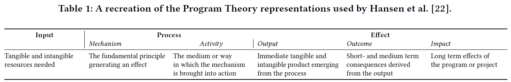

# Week 12: Best of CHI 2021

## What Do Hackathons Do? Understanding Participation in Hackathons Through Program Theory Analysis

- Falk, J., Kannabiran, G., & Hansen, N. B. (2021, May). [What Do Hackathons Do? Understanding Participation in Hackathons Through Program Theory Analysis](https://dl.acm.org/doi/abs/10.1145/3411764.3445198). In _Proceedings of the 2021 CHI Conference on Human Factors in Computing Systems_.

- Hackathons
  - Put on by organizers
    - Makerspace
    - Hackerspace
    - etc...
  - not just for nerds any more.
  - rapid prototyping resource for companies
- Program Theory
  - approach used to understand
    - processes
    - how to evaluate a program
  - 
  - inputs
    - resources needed to initiate and complete a program
      - eg.
        - design materials or tools in hackathon
        - design challenge
  - process
    - activities that are conducted during program by participants
      - mechanisms are supported by activies
        - general principles that generate effects.
        - eg.
          - mid-session hackathon workshops to improve prototyping proficiency
            - could lead to better quality prototypes
  - effects
    - outputs
      - immediate tangible and intangible products of process
      - eg.
        - prototypes made during hackathon
    - outcomes
      - short and midterm
      - eg.
        - consequences, benefits or drawbacks of program
        - startup company made from hackathon idea
    - impacts
      - long term
      - hard to determine specific hackathon cause
      - eg.
        - hope and belonging by members
- Method of Analysis of papers
  - hackathon domain (edu, research, civic)
  - main organization approach for specific hackathon (choice of material)
  - reason for format modification
  - elements
    - input
    - process
    - output

## “Can I Not Be Suicidal on a Sunday?”: Understanding Technology-Mediated Pathways to Mental Health Support.

- Pendse, S. R., Sharma, A., Vashistha, A., De Choudhury, M., & Kumar, N. (2021, May). [“Can I Not Be Suicidal on a Sunday?”: Understanding Technology-Mediated Pathways to Mental Health Support.](https://dl.acm.org/doi/abs/10.1145/3411764.3445410) In _Proceedings of the 2021 CHI Conference on Human Factors in Computing Systems_.

- Empirical study
- Phone hotlines in India
  - barriers for care
    - societal norms
      - marginalization
      - stigma
      - depression
    - personal identity
    - laws
    - institution aversion
- Pathways to Care model
  - Goldberg and Huxley
  - maps process for assigning mental illness to people
  - power differential problems

## “Why lose control?” A Study of Freelancers’ Experiences with Gig Economy Platforms.

- Carlos Alvarez de la Vega, J., E. Cecchinato, M., & Rooksby, J. (2021, May). [“Why lose control?” A Study of Freelancers’ Experiences with Gig Economy Platforms.](https://dl.acm.org/doi/abs/10.1145/3411764.3445305) In _Proceedings of the 2021 CHI Conference on Human Factors in Computing Systems_.

- Empirical study
- Qualitative Analysis of four Reddit subreddits
  - Showed tensions between
    - wanting autonomy and control
    - necessity of opportunities and convenience

## Understanding data accessibility for people with intellectual and developmental disabilities.

- Wu, K., Petersen, E., Ahmad, T., Burlinson, D., Tanis, S., & Szafir, D. A. (2021, May). [Understanding data accessibility for people with intellectual and developmental disabilities.](https://dl.acm.org/doi/abs/10.1145/3411764.3445743) In _Proceedings of the 2021 CHI Conference on Human Factors in Computing Systems_ (pp. 1-16).

- Analysis
  - 
  - measured performance for different visualization designs
    - four tasks
  - interviews
  - independent vars
    - chart type
    - chart embellishment
    - data continuity
    - ability level
  - dependent vars
    - task completion accuracy
    - response time

## Heuristic Evaluation of Conversational Agents.

- Langevin, R., Lordon, R. J., Avrahami, T., Cowan, B. R., Hirsch, T., & Hsieh, G. (2021, May). [Heuristic Evaluation of Conversational Agents.](https://dl.acm.org/doi/abs/10.1145/3411764.3445312) In _Proceedings of the 2021 CHI Conference on Human Factors in Computing Systems_.

- Heuristic evaluation type
- Evaluated metrics for testing robot performance for two interfaces:
  - chatbot
  - voice
- The four phased design process.
  - Phase 1: Heuristic Generation
  - Phase 2: Expert Review
    - 
  - Phase 3: Validation through Heuristic Evaluation
    - The conversational agent heuristics developed in Phase 3
      - Visibility of system status
      - Match between system and the real world
      - User control and freedom
      - Consistency and standards
      - Error prevention
      - Help and guidance
      - Flexibility and efciency of use
      - Aesthetic, minimalist and engaging design
      - Help users recognize, diagnose and recover from errors
      - Context preservation
      - Trustworthiness
  - Phase 4: Validation of Revised Heuristics
    - 
- Better evaluators than Nielsen's.
  - Identified issues related to
    - dialog content
    - interaction design
    - help and guidace,
    - human-like cyharacteristics
    - data privacy

## “That courage to encourage”: Participation and Aspirations in Chat-based Peer Support for Youth Living with HIV.

- Karusala, N., Seeh, D. O., Mugo, C., Guthrie, B., Moreno, M. A., John-Stewart, G., Inwani, I., Anderson, R. & Ronen, K. (2021, May). [“That courage to encourage”: Participation and Aspirations in Chat-based Peer Support for Youth Living with HIV.](https://dl.acm.org/doi/abs/10.1145/3411764.3445313) In _Proceedings of the 2021 CHI Conference on Human Factors in Computing Systems_.

- Qualitative and Empirical study (Kenya)
- Stigma with HIV causes privacy issues
  - phone sharing
- Data collection: surveys, notes, chat records, and audo recorded interviews.
- The Rewards and Limitations of Facilitated Peer Support
  - Exchanging Emotional and Informational Support
  - Rediscovering Aspirations and Ways to Achieve Them
  - Feeling the Limitations of Peer Support
- Problems:
  - High volume of unstructured data
  - Chat group can be taken over by non-facilitators
- Positive Results:
  - found that aspirations, along with a sense of community, could motivate participants to try to stick with difcult tasks.

## Designing Interactive Transfer Learning Tools for ML Non-Experts.

- Mishra, S., & Rzeszotarski, J. M. (2021, May). [Designing Interactive Transfer Learning Tools for ML Non-Experts.](https://dl.acm.org/doi/abs/10.1145/3411764.3445096) In _Proceedings of the 2021 CHI Conference on Human Factors in Computing Systems_ (pp. 1-15).

- Transfer Learning
  - Reuse trained ML models (transfer to new application)
  - Still mostly experts-only
    - curated (model zoos) domain-specific pre-trained toolkits
    - lots of subtasks
      - identify transfer candidates
      - successful transfer
      - performance eval
      - next step identification

- Study of non-expert behavior during transfer learning activities

  - focus on convolutional neural nets
    - identify object boundaries, colors and shapes in an image
    - transfer those to models
    - filters exposed as "layer" with features
      - "layer" would match novice user intuition better

- participants

  - self-selected via:
    - knowledge of reading and writing about/for a given domain
    - desire to learn about ML to complete a task (side-benefit)

- Empirical (Qualitative) observations

  - 

- Conceptual Model
  - 
